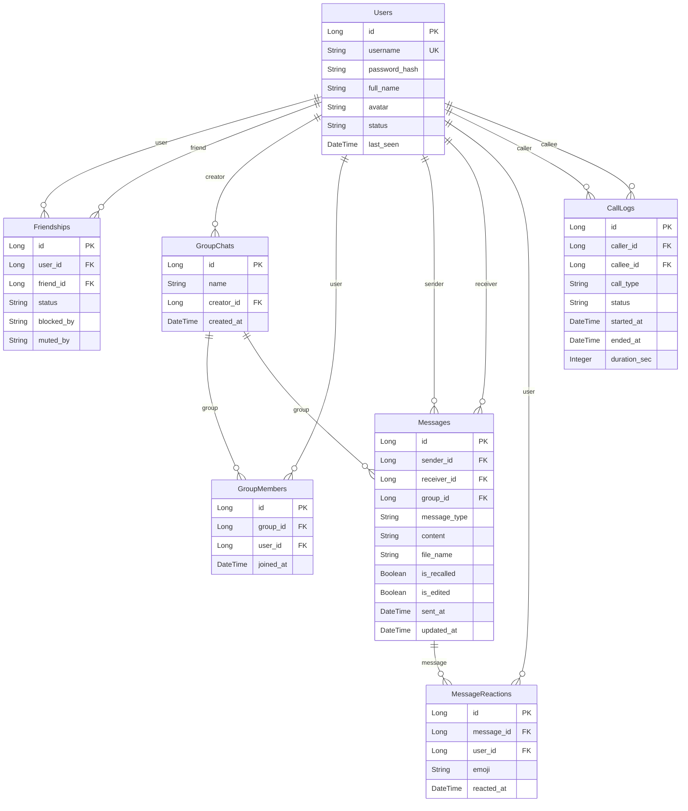
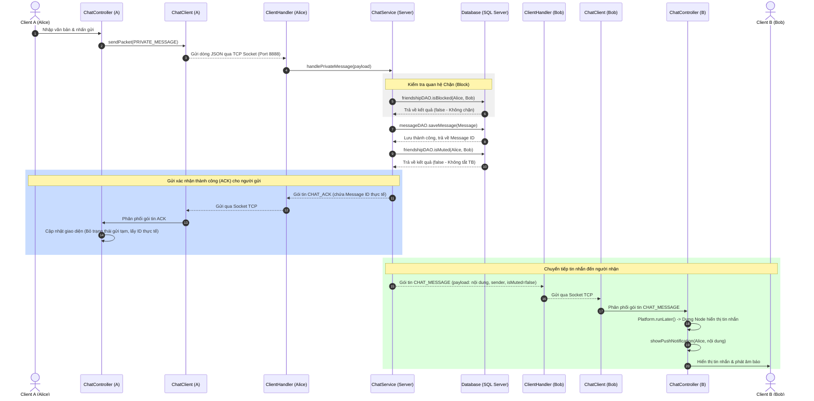
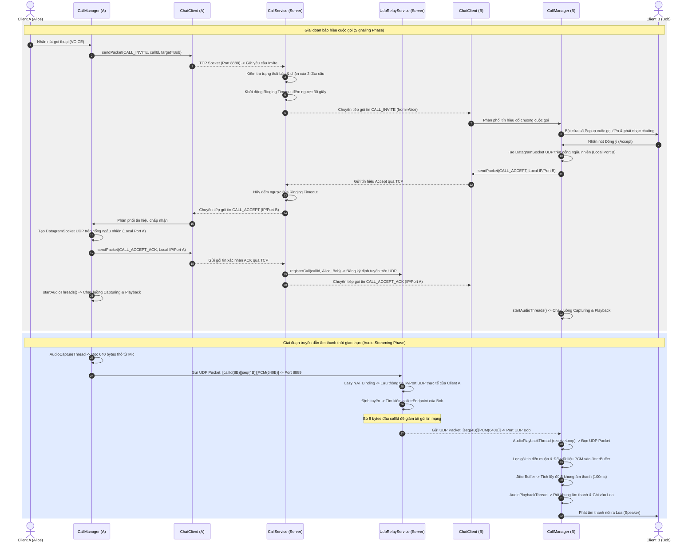
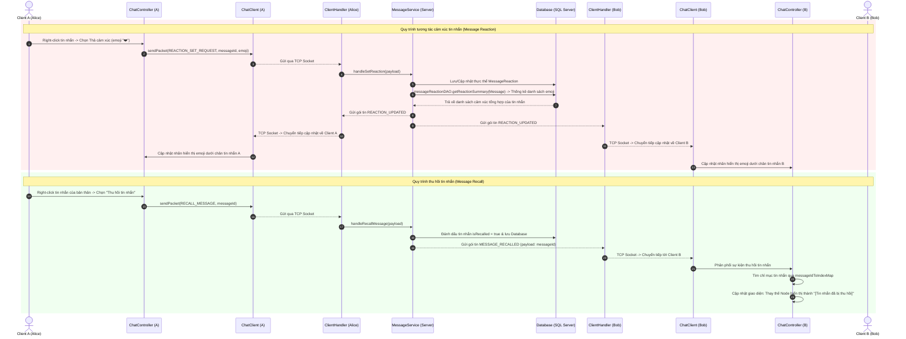

# TÀI LIỆU PHÂN TÍCH CHI TIẾT TOÀN BỘ CODEBASE DỰ ÁN JAVACHAT
**Dự án:** Ứng dụng chat thời gian thực và gọi thoại VoIP  
**Kiến trúc:** Client-Server (JavaFX Desktop Client + TCP & UDP Server)  
**Ngôn ngữ:** Java 17, JavaFX 17  
**Công nghệ:** Hibernate ORM, MS SQL Server, GSON, jBCrypt, Java Sound API  

---

## MỤC LỤC
1. [GIỚI THIỆU CHUNG VÀ KIẾN TRÚC HỆ THỐNG](#1-giới-thiệu-chung-và-kiến-trúc-hệ-thống)
2. [PHÂN TÍCH CHI TIẾT TẦNG CLIENT (JAVAFX CLIENT DEEP DIVE)](#2-phân-tích-chi-tiết-tầng-client-javafx-client-deep-dive)
    - [2.1. Lớp khởi chạy và quản lý mạng: ClientApplication & ChatClient](#21-lớp-khởi-chạy-và-quản-lý-mạng-clientapplication--chatclient)
    - [2.2. Hệ thống gọi thoại VoIP: CallManager, CallSession, RingtonePlayer](#22-hệ-thống-gọi-thoại-voip-callmanager-callsession-ringtoneplayer)
    - [2.3. Xử lý âm thanh cuộc gọi: AudioCaptureThread, AudioPlaybackThread, JitterBuffer](#23-xử-lý-âm-thanh-cuộc-gọi-audiocapturethread-audioplaybackthread-jitterbuffer)
    - [2.4. Tiện ích âm thanh tin nhắn thoại: VoiceRecorder, VoicePlayer](#24-tiện-ích-âm-thanh-tin-nhắn-thoại-voicerecorder-voiceplayer)
    - [2.5. Các Controller giao diện: Login, Register, IncomingCall, CallView, ChatController](#25-các-controller-giao-diện-login-register-incomingcall-callview-chatcontroller)
3. [PHÂN TÍCH CHI TIẾT TẦNG COMMON (SHARED CORE LIBRARY)](#3-phân-tích-chi-tiết-tầng-common-shared-core-library)
    - [3.1. Các thực thể dữ liệu JPA Entities](#31-các-thực-thể-dữ-liệu-jpa-entities)
    - [3.2. Cấu trúc truyền tải dữ liệu: Packet, CallPacketTypes, CallPayloads](#32-cấu-trúc-truyền-tải-dữ-liệu-packet-callpackettypes-callpayloads)
4. [PHÂN TÍCH CHI TIẾT TẦNG SERVER (SERVER DEEP DIVE)](#4-phân-tích-chi-tiết-tầng-server-server-deep-dive)
    - [4.1. Core Server & Quản lý kết nối: ServerApplication, ServerManager, ClientHandler](#41-core-server--quản-lý-kết-nối-serverapplication-servermanager-clienthandler)
    - [4.2. Dịch vụ trung chuyển âm thanh UDP: UdpRelayService](#42-dịch-vụ-trung-chuyển-âm-thanh-udp-udprelayservice)
    - [4.3. Các dịch vụ nghiệp vụ: AuthService, ChatService, FriendService, MessageService, CallService](#43-các-dịch-vụ-nghiệp-vụ-authservice-chatservice-friendservice-messageservice-callservice)
    - [4.4. Tầng Data Access Object (DAO) & Hibernate Configuration](#44-tầng-data-access-object-dao--hibernate-configuration)
5. [SƠ ĐỒ TRUYỀN TIN VÀ HOẠT ĐỘNG CHI TIẾT (INTERACTIVE SEQUENCE DIAGRAMS)](#5-sơ-đồ-truyền-tin-và-hoạt-động-chi-tiết-interactive-sequence-diagrams)

---

## 1. GIỚI THIỆU CHUNG VÀ KIẾN TRÚC HỆ THỐNG

Dự án JavaChat là một ứng dụng chat và VoIP Client-Server hoàn chỉnh được tối ưu hóa cho các hệ thống Desktop. 

Hệ thống hoạt động trên hai kênh truyền tải song song:
1. **TCP (Port 8888):** Đảm bảo độ tin cậy của thông tin. Mọi thông tin tài khoản, cấu trúc nhóm, nội dung tin nhắn chat (bao gồm cả các dữ liệu Base64 của ảnh, file, voice tin nhắn thoại) và báo hiệu cuộc gọi (signaling) đều đi qua kênh này.
2. **UDP (Port 8889):** Đảm bảo tốc độ truyền phát tối đa của âm thanh cuộc gọi. Gói tin âm thanh thô (PCM) được gửi trực tiếp lên Server qua UDP, Server thực hiện định tuyến và chuyển phát tiếp tục qua UDP đến tai người nhận.

Sơ đồ hoạt động vật lý của hệ thống:

```text
+----------------------------------------+            +----------------------------------------+
|             CLIENT A (JavaFX)          |            |             CLIENT B (JavaFX)          |
|                                        |            |                                        |
|  +--------------+    +--------------+  |            |  +--------------+    +--------------+  |
|  |  ChatClient  |    | Audio threads|  |            |  |  ChatClient  |    | Audio threads|  |
|  +------+-------+    +------+-------+  |            |  +------+-------+    +------+-------+  |
+---------|-------------------|----------+            +---------|-------------------|----------+
          |                   |                                 |                   |
          | TCP               | UDP                             | TCP               | UDP
          | Signaling         | Audio                           | Signaling         | Audio
          | Port 8888         | Port 8889                       | Port 8888         | Port 8889
          ▼                   ▼                                 ▼                   ▼
+---------|-------------------|---------------------------------|-------------------|----------+
|         |                   |                                 |                   |          |
|  +------▼-------+    +------▼-------+                  +------▼-------+    +------▼-------+  |
|  |ClientHandler |    |              |                  |ClientHandler |    |              |  |
|  |   (TCP)      |    |              |                  |   (TCP)      |    |              |  |
|  +------+-------+    |              |                  +------+-------+    |              |  |
|         |            |  UdpRelay    |                         |            |  UdpRelay    |  |
|  +------▼-------+    |   Service    |                  +------▼-------+    |   Service    |  |
|  |  Services    |    |              |                  |  Services    |    |              |  |
|  +------+-------+    +------▲-------+                  +------+-------+    +------▲-------+  |
|         |                   |                                 |                   |          |
|  +------▼-------+           | (Relay mapping by callId)       +------▼-------+           |          |
|  |Hibernate Util|-----------+                                 |Hibernate Util|-----------+          |
|  +------+-------+                                             +------+-------+                       |
|         |                                                            |                               |
|  +------▼-------+                                             +------▼-------+                       |
|  | SQL Server   |                                             | SQL Server   |                       |
|  +--------------+                                             +--------------+                       |
|                                     CHAT SERVER                                              |
+----------------------------------------------------------------------------------------------+
```

---

## 2. PHÂN TÍCH CHI TIẾT TẦNG CLIENT (JAVAFX CLIENT DEEP DIVE)

Phía Client là một ứng dụng JavaFX Desktop hoàn chỉnh sử dụng cơ chế nạp FXML cho giao diện UI, kết nối mạng TCP socket và xử lý âm thanh qua microphone/speaker.

### 2.1. Lớp khởi chạy và quản lý mạng: ClientApplication & ChatClient

#### 2.1.1. ClientApplication.java
Lớp [ClientApplication.java](file:///c:/Users/XIAOXIN/IdeaProjects/JavaChat/src/main/java/org/example/client/ClientApplication.java) kế thừa `javafx.application.Application` và đóng vai trò là điểm khởi động của chương trình.
- **`start(Stage primaryStage)`**: 
  1. Khởi tạo một phiên bản `ChatClient` duy nhất (Single instance).
  2. Gọi phương thức kết nối socket tới server tại địa chỉ `localhost` cổng `8888`. Nếu kết nối thất bại, ứng dụng in lỗi và đóng chương trình với mã thoát `1`.
  3. Khởi tạo cấu hình cho `CallManager` bằng cách truyền tham chiếu `chatClient`.
  4. Sử dụng `FXMLLoader` để nạp tệp tài nguyên `/fxml/Login.fxml`, thiết lập giao diện đăng nhập trên `primaryStage` kích thước cố định `400x400`, không cho phép thay đổi kích thước (`setResizable(false)`).
  5. Đăng ký sự kiện tắt ứng dụng (`setOnCloseRequest`): Khi người dùng đóng cửa sổ, gọi `chatClient.disconnect()` để thông báo tắt kết nối lên server, giải phóng tài nguyên JavaFX thông qua `Platform.exit()` và tắt chương trình chạy ngầm `System.exit(0)`.

#### 2.1.2. ChatClient.java
Lớp [ChatClient.java](file:///c:/Users/XIAOXIN/IdeaProjects/JavaChat/src/main/java/org/example/client/network/ChatClient.java) chịu trách nhiệm quản lý kết nối socket TCP và điều phối các gói tin nhận được.
- **Các trường thuộc tính:**
  - `socket` (Socket): Kết nối socket TCP đến server.
  - `out` (PrintWriter): Kênh đầu ra để gửi gói tin lên server.
  - `in` (BufferedReader): Kênh đầu vào để nhận dữ liệu từ server.
  - `listenerThread` (Thread): Luồng daemon chạy ngầm lắng nghe các dòng dữ liệu truyền về từ Socket.
  - `listeners` (List<Consumer<Packet>>): Danh sách các đối tượng callback lắng nghe các sự kiện nhận gói tin.
  - `serverHost` (String): Lưu địa chỉ IP của server phục vụ cho cấu hình kết nối UDP trong cuộc gọi.
- **Các phương thức chính:**
  - **`connect(String host, int port)`**: Thực hiện kết nối socket nhị phân. Gán `serverHost = host`. Khởi tạo `PrintWriter` với chế độ auto-flush (tự động đẩy dữ liệu khi có ký tự xuống dòng). Tạo và khởi chạy `listenerThread`.
  - **`listenForPackets()`**: Chạy vòng lặp vô hạn `while ((line = in.readLine()) != null)`. Mỗi dòng nhận được chuyển đổi ngược thành đối tượng `Packet` thông qua Gson. Sử dụng khối đồng bộ `synchronized (this)` để sao chép danh sách `listeners` sang một mảng tạm thời nhằm tránh lỗi tương tranh dữ liệu (`ConcurrentModificationException`) khi có một controller khác đăng ký hoặc gỡ bỏ lắng nghe sự kiện trong lúc luồng đang phân phối gói tin. Phân phối gói tin đến tất cả các callback.
  - **`sendPacket(Packet packet)`**: Chuyển đổi gói tin sang chuỗi JSON và gửi lên server.
  - **`disconnect()`**: Đóng socket TCP một cách an sau.

---

### 2.2. Hệ thống gọi thoại VoIP: CallManager, CallSession, RingtonePlayer

#### 2.2.1. CallSession.java
Lớp [CallSession.java](file:///c:/Users/XIAOXIN/IdeaProjects/JavaChat/src/main/java/org/example/client/call/CallSession.java) lưu trữ thông tin về một phiên cuộc gọi hiện tại ở phía client.
- **Enums:**
  - `Role`: Vai trò trong cuộc gọi (`CALLER` - Người gọi, `CALLEE` - Người nhận).
  - `State`: Trạng thái cuộc gọi (`RINGING_OUTGOING`, `RINGING_INCOMING`, `CONNECTING`, `ACTIVE`, `ENDED`).
- **Các trường thuộc tính:**
  - `callId` (String): Định danh duy nhất của cuộc gọi (8 ký tự).
  - `role` (Role): Vai trò client.
  - `peerUsername` (String): Tên của đối phương.
  - `type` (String): Kiểu cuộc gọi (`VOICE` hoặc `VIDEO`).
  - `state` (State): Trạng thái phiên hiện tại.
  - `peerIp` (String), `peerUdpPort` (int): Thông tin IP và cổng UDP của đối phương.
  - `udpSocket` (DatagramSocket): Socket UDP cục bộ để truyền nhận âm thanh.
  - `localUdpPort` (int): Cổng UDP cục bộ đang bind.
  - `startedAt` (Instant), `connectedAt` (Instant): Mốc thời gian bắt đầu và kết nối cuộc gọi.
  - `captureThread` (AudioCaptureThread), `playbackThread` (AudioPlaybackThread): Hai luồng xử lý thu âm và phát âm thanh.

#### 2.2.2. CallManager.java
Lớp [CallManager.java](file:///c:/Users/XIAOXIN/IdeaProjects/JavaChat/src/main/java/org/example/client/call/CallManager.java) quản lý vòng đời và trạng thái cuộc gọi phía client, đóng vai trò là một máy trạng thái (State Machine).
- **Thiết kế Singleton**: Cung cấp `init(ChatClient)` và `getInstance()` để truy cập toàn cục.
- **Khởi tạo cuộc gọi (`startCall(String peer, String type)`)**:
  - Kiểm tra nếu `currentSession != null`, thông báo người dùng đang bận.
  - Sinh một khóa cuộc gọi ngẫu nhiên `callId` bằng cách lấy 8 ký tự đầu của chuỗi UUID.
  - Tạo `CallSession` mới, thiết lập trạng thái `RINGING_OUTGOING`, gán vai trò `CALLER` và ghi nhận thời gian bắt đầu.
  - Gửi gói tin TCP `CALL_INVITE` chứa payload bao gồm: tên người nhận, ID cuộc gọi, loại cuộc gọi (`VOICE`).
  - Kích hoạt sự kiện `fireOutgoingCallStarted`.
- **Hủy cuộc gọi (`cancelCall()`)**:
  - Kiểm tra trạng thái cuộc gọi phải là `RINGING_OUTGOING`.
  - Gửi gói tin `CALL_CANCEL` lên server và gọi hàm giải phóng tài nguyên `cleanup("Đã hủy")`.
- **Chấp nhận cuộc gọi (`acceptCall()`)**:
  - Kiểm tra trạng thái cuộc gọi phải là `RINGING_INCOMING`.
  - Khởi tạo đối tượng `DatagramSocket` trên một cổng ngẫu nhiên khả dụng (`new DatagramSocket(0)`). Ghi nhận cổng cục bộ qua `getLocalPort()`.
  - Chuyển trạng thái session sang `CONNECTING`.
  - Gửi gói tin `CALL_ACCEPT` chứa thông tin cổng UDP cục bộ và địa chỉ IP của client lên server.
  - Kích hoạt sự kiện `fireCallConnecting`.
- **Từ chối cuộc gọi (`rejectCall(String reason)`)**:
  - Gửi gói tin `CALL_REJECT` chứa mã lý do từ chối lên server và dọn dẹp phiên.
- **Nhận gói tin điều phối cuộc gọi (`handlePacket(Packet packet)`)**:
  - Lắng nghe các gói tin bắt đầu bằng tiền tố `CALL_`.
  - Định tuyến đến các phương thức xử lý tương ứng:
    - **`onInviteReceived`**: Nếu client đang rảnh, tạo `CallSession` mới dạng `RINGING_INCOMING` và kích hoạt chuông sự kiện `fireIncomingCall`. Nếu đang bận, gửi ngược lại gói tin `CALL_BUSY` lên server.
    - **`onAcceptReceived`**: Khi người gọi nhận được tín hiệu chấp nhận từ callee. Ghi nhận IP và cổng UDP của đối phương. Tạo một `DatagramSocket` cục bộ của người gọi. Gửi phản hồi xác nhận `CALL_ACCEPT_ACK` chứa IP/Port UDP của người gọi. Chuyển trạng thái sang `ACTIVE`, khởi chạy các luồng xử lý âm thanh `startAudioThreads()` và kích hoạt sự kiện `fireCallActive`.
    - **`onAckReceived`**: Khi người nhận cuộc gọi nhận được xác nhận ACK từ người gọi. Ghi nhận IP/Port đối phương, chuyển trạng thái sang `ACTIVE`, khởi động các luồng âm thanh và chuyển cuộc gọi sang chế độ đàm thoại.
    - **`onRejectReceived` / `onCancelReceived` / `onEndReceived` / `onBusyReceived` / `onFailedReceived`**: Dọn dẹp tài nguyên và thông báo trạng thái kết thúc cuộc gọi tới giao diện.
- **Heartbeat Monitor (`startHeartbeatMonitor()`)**:
  - Tạo một luồng chạy ngầm giám sát kết nối UDP. 
  - Vòng lặp định kỳ mỗi 1 giây kiểm tra chỉ số `packetsReceived` trong luồng Playback. 
  - Nếu trong 1 giây không có gói tin nào tăng lên, luồng sẽ ngủ thêm 4 giây nữa (tổng cộng 5 giây). Nếu sau 5 giây chỉ số vẫn giữ nguyên, hệ thống xác định đối phương bị mất kết nối mạng đột ngột và tự động gọi `endCall()` để tránh treo cuộc gọi.
- **Giải phóng tài nguyên (`cleanup(String reason)`)**:
  - Ngắt luồng giám sát heartbeat.
  - Gọi phương thức đóng/ngắt an toàn trên `AudioCaptureThread` và `AudioPlaybackThread`.
  - Đóng `DatagramSocket` UDP để giải phóng cổng của hệ điều hành.
  - Đặt `currentSession = null` để giải phóng trạng thái bận và kích hoạt sự kiện `fireCallEnded`.

#### 2.2.3. RingtonePlayer.java
Lớp [RingtonePlayer.java](file:///c:/Users/XIAOXIN/IdeaProjects/JavaChat/src/main/java/org/example/client/call/RingtonePlayer.java) thực hiện phát âm thanh chuông cuộc gọi đến bằng một cấu trúc Singleton.
- **`start()`**:
  - Nếu đang phát (`playing == true`), bỏ qua.
  - Đọc luồng tài nguyên `/audio/ringtone.wav`.
  - Nếu không tìm thấy file nhạc chuông, hệ thống kích hoạt cơ chế dự phòng: Tạo một luồng ẩn phát tiếng bíp mặc định của hệ điều hành qua `java.awt.Toolkit.getDefaultToolkit().beep()` cứ mỗi 2 giây.
  - Nếu tìm thấy file, sử dụng lớp `AudioSystem.getAudioInputStream` đọc file và gán vào đối tượng `Clip`. Gọi `clip.loop(Clip.LOOP_CONTINUOUSLY)` để phát chuông lặp vô hạn và khởi chạy.
- **`stop()`**:
  - Đặt cờ hiệu `playing = false`.
  - Dừng phát `clip.stop()`, giải phóng tài nguyên `clip.close()` và giải phóng bộ nhớ.

---

### 2.3. Xử lý âm thanh cuộc gọi: AudioCaptureThread, AudioPlaybackThread, JitterBuffer

#### 2.3.1. AudioCaptureThread.java
Lớp [AudioCaptureThread.java](file:///c:/Users/XIAOXIN/IdeaProjects/JavaChat/src/main/java/org/example/client/call/AudioCaptureThread.java) là luồng ghi âm dữ liệu từ mic.
- **Các hằng số cấu hình:**
  - `FORMAT` (AudioFormat): 16kHz, 16-bit, Mono, Signed PCM, Little-Endian.
  - `FRAME_SIZE`: `640` bytes (Tương đương 20ms âm thanh thô).
- **Vòng lặp thu âm (`run()`)**:
  - Sử dụng `AudioSystem.getLine()` để lấy đường dẫn dữ liệu phần cứng microphone (`TargetDataLine`).
  - Mở cổng `micLine.open(FORMAT)` và kích hoạt ghi âm `micLine.start()`.
  - Khởi tạo bộ đệm gửi dữ liệu `sendBuffer` có kích thước bằng: `8 (callId)` + `4 (seq)` + `640 (PCM data)` = `652` bytes.
  - Vòng lặp `while (running)`:
    - Đọc đúng 640 bytes dữ liệu thô từ microphone bằng phương thức chặn `micLine.read(audioBuffer, 0, FRAME_SIZE)`.
    - Nếu thu âm thành công và thiết bị không bị tắt tiếng (`muted == false`):
      1. Sao chép 8 bytes tiền tố cuộc gọi `callIdPrefix` vào vị trí đầu của `sendBuffer` (mục đích để Server UDP Relay phân tích luồng).
      2. Chuyển đổi số thứ tự gói tin `sequenceNumber` (int) thành 4 bytes dạng Big-Endian và chèn vào bộ đệm gửi:
         ```java
         sendBuffer[offset]     = (byte) ((sequenceNumber >> 24) & 0xFF);
         sendBuffer[offset + 1] = (byte) ((sequenceNumber >> 16) & 0xFF);
         sendBuffer[offset + 2] = (byte) ((sequenceNumber >> 8) & 0xFF);
         sendBuffer[offset + 3] = (byte) (sequenceNumber & 0xFF);
         ```
      3. Sao chép dữ liệu âm thanh thô ghi được từ mic vào vị trí còn lại của bộ đệm gửi.
      4. Tạo gói tin `DatagramPacket` truyền tải dữ liệu và gửi đi qua UDP Socket tới địa chỉ IP của server (cổng `8889`).
      5. Tăng trị số `sequenceNumber` lên 1 đơn vị.
- **`shutdown()`**: Đặt cờ dừng luồng và gọi `this.interrupt()` để đánh thức luồng nếu đang bị chặn ở hàm đọc dữ liệu mic. Giải phóng, dừng và đóng `TargetDataLine` trong khối `finally`.

#### 2.3.2. AudioPlaybackThread.java
Lớp [AudioPlaybackThread.java](file:///c:/Users/XIAOXIN/IdeaProjects/JavaChat/src/main/java/org/example/client/call/AudioPlaybackThread.java) thực hiện nhận dữ liệu âm thanh từ mạng và phát ra loa.
- **Kiến trúc luồng kép:**
  - Kế thừa lớp `Thread` để xử lý vòng lặp phát âm thanh thô ra loa.
  - Chứa một luồng con chạy ngầm độc lập `receiveThread` xử lý vòng lặp tiếp nhận gói tin UDP từ mạng nhằm tránh việc nghẽn luồng phát loa làm méo tiếng.
- **Phương thức khởi chạy luồng phát (`run()`)**:
  - Khởi chạy luồng con `receiveThread`.
  - Mở kênh âm thanh loa `SourceDataLine` với định dạng `FORMAT`. Cấu hình kích thước bộ đệm phần cứng loa là `FRAME_SIZE * 4` (2560 bytes) để hạn chế tối đa hiện tượng trễ phần cứng.
  - Vòng lặp phát:
    - Gọi phương thức chặn `jitterBuffer.take(20)` để rút khung âm thanh ra khỏi bộ đệm chống rung giật.
    - Nếu không lấy được khung âm thanh (trễ mạng): Ghi mảng byte lặng `SILENCE` vào loa để duy trì tín hiệu sóng âm liên tục.
    - Nếu lấy được khung âm thanh thành công: Ghi mảng byte vào loa bằng hàm `speakerLine.write()`.
- **Phương thức luồng nhận mạng (`receiveLoop()`)**:
  - Cấu hình thời gian timeout của socket UDP nhận dữ liệu là 200ms để tránh luồng bị treo vĩnh viễn khi cuộc gọi ngắt đột ngột.
  - Nhận gói tin UDP thông qua `socket.receive()`.
  - Đọc dữ liệu gói tin. Do gói tin nhận về đã được Server UDP Relay bỏ 8 bytes tiền tố cuộc gọi, gói tin chỉ còn chứa: `4 bytes seq` + `640 bytes audio`.
  - Giải mã số thứ tự `seq`:
    ```java
    int seq = ((buffer[0] & 0xFF) << 24)
            | ((buffer[1] & 0xFF) << 16)
            | ((buffer[2] & 0xFF) << 8)
            | (buffer[3] & 0xFF);
    ```
  - Thực hiện thuật toán lọc gói tin đến muộn: Nếu `seq <= lastSeq`, bỏ qua gói tin này.
  - Tính toán số lượng gói tin bị mất trên đường truyền:
    ```java
    if (lastSeq >= 0 && seq > lastSeq + 1) {
        packetsLost += (seq - lastSeq - 1);
    }
    ```
  - Sao chép 640 bytes dữ liệu âm thanh thô và đẩy vào `jitterBuffer`.

#### 2.3.3. JitterBuffer.java
Lớp [JitterBuffer.java](file:///c:/Users/XIAOXIN/IdeaProjects/JavaChat/src/main/java/org/example/client/call/JitterBuffer.java) là bộ đệm chống rung giật cho dữ liệu âm thanh truyền tải qua internet.
- **Cơ chế hoạt động:**
  - Sử dụng cấu trúc hàng đợi chặn giới hạn dung lượng `LinkedBlockingQueue<byte[]>` với sức chứa tối đa `CAPACITY = 20` khung âm thanh (tương đương 400ms).
  - Cung cấp cờ hiệu `prebuffering` để quản lý quá trình tích lũy trước gói tin. Trạng thái prebuffering mặc định là `true` khi khởi tạo hoặc khi xảy ra hiện tượng cạn kiệt bộ đệm (underrun).
  - **`put(byte[] frame)`** (Đầu vào từ mạng):
    - Đẩy phần tử vào hàng đợi bằng hàm `offer()`. Nếu hàng đợi đầy (vượt quá 20 khung), gọi `poll()` để giải phóng gói tin cũ nhất ở đầu hàng đợi rồi mới chèn gói tin mới. Việc này giúp giữ trễ truyền dẫn luôn ở mức thấp.
    - Nếu đang ở trạng thái prebuffering và số lượng phần tử trong hàng đợi vượt quá ngưỡng tối thiểu `MIN_PREBUFFER = 5` (100ms âm thanh), đặt cờ `prebuffering = false` để kích hoạt đầu ra cho luồng phát.
  - **`take(long timeoutMs)`** (Đầu ra phát loa):
    - Nếu `prebuffering == true`: Luồng ngủ chặn trong khoảng thời gian `timeoutMs` (20ms) và trả về giá trị `null` để luồng phát loa chủ động ghi mảng lặng.
    - Thực hiện rút gói tin ra khỏi hàng đợi bằng phương thức `queue.poll(timeoutMs, TimeUnit.MILLISECONDS)`.
    - Nếu hàng đợi cạn kiệt (trả về `null`), kích hoạt lại cờ `prebuffering = true` và trả về bản sao của khung âm thanh phát thành công gần nhất `lastFrame` (Áp dụng giải thuật Packet Loss Concealment - PLC đơn giản để che dấu lỗi âm thanh).
    - Nếu lấy được khung âm thanh, ghi nhận vào `lastFrame` và trả về dữ liệu.

---

### 2.4. Tiện ích âm thanh tin nhắn thoại: VoiceRecorder, VoicePlayer

#### 2.4.1. VoiceRecorder.java
Lớp [VoiceRecorder.java](file:///c:/Users/XIAOXIN/IdeaProjects/JavaChat/src/main/java/org/example/client/util/VoiceRecorder.java) hỗ trợ tính năng ghi âm tin nhắn thoại và lưu thành định dạng file WAV chuẩn để gửi đi.
- **`start()`**:
  - Khởi tạo bộ nhớ tạm để chứa dữ liệu nhị phân `rawAudio = new ByteArrayOutputStream()`.
  - Thiết lập luồng thu âm của hệ điều hành `TargetDataLine` với định dạng `FORMAT` (16kHz, 16-bit, Mono).
  - Mở thiết bị, bắt đầu ghi âm và kích hoạt cờ `recording = true`.
  - Khởi chạy luồng con `captureThread` để đọc dữ liệu mic và đẩy vào `rawAudio` liên tục theo từng khối 4096 bytes để tránh treo giao diện người dùng.
- **`stop()`**:
  - Đặt cờ `recording = false` để kết thúc vòng lặp ghi âm. Dừng và đóng kết nối `TargetDataLine`.
  - Đợi luồng thu âm kết thúc bằng phương thức `captureThread.join(500)`.
  - Lấy mảng byte dữ liệu PCM thô thu được qua `rawAudio.toByteArray()`.
  - Tiến hành đóng gói dữ liệu PCM thô này thành cấu trúc file WAV chuẩn (chứa thông tin header WAVE) thông qua luồng nạp `AudioSystem.write()`:
    ```java
    long frameLength = pcmBytes.length / FORMAT.getFrameSize();
    try (AudioInputStream audioInputStream = new AudioInputStream(new ByteArrayInputStream(pcmBytes), FORMAT, frameLength);
         ByteArrayOutputStream wavOut = new ByteArrayOutputStream()) {
        AudioSystem.write(audioInputStream, AudioFileFormat.Type.WAVE, wavOut);
        return wavOut.toByteArray();
    }
    ```
    Trả về mảng byte dữ liệu đã được định dạng WAV hoàn chỉnh để Client tiến hành mã hóa Base64 và gửi lên Server.

#### 2.4.2. VoicePlayer.java
Lớp [VoicePlayer.java](file:///c:/Users/XIAOXIN/IdeaProjects/JavaChat/src/main/java/org/example/client/util/VoicePlayer.java) là lớp tiện ích tĩnh (utility class) hỗ trợ phát file âm thanh tin nhắn thoại nhận về từ mạng.
- **`play(byte[] wavBytes)`**:
  - Tiếp nhận mảng byte dữ liệu tệp tin WAV.
  - Sử dụng `AudioSystem.getAudioInputStream` để đọc luồng dữ liệu từ bộ đệm mảng byte.
  - Lấy đối tượng phát âm thanh `Clip` thông qua `AudioSystem.getClip()`.
  - Đăng ký bộ lắng nghe sự kiện phát âm thanh `LineListener`: Khi âm thanh chạy hết và dừng phát (`LineEvent.Type.STOP`), gọi phương thức `clip.close()` để tự động giải phóng kênh âm thanh của hệ điều hành.
  - Mở luồng dữ liệu âm thanh `clip.open(audioInputStream)` và kích hoạt phát `clip.start()`.

---

### 2.5. Các Controller giao diện: Login, Register, IncomingCall, CallView, ChatController

Các controller điều hướng và liên kết giao diện JavaFX FXML với logic nghiệp vụ.

#### 2.5.1. LoginController.java
Lớp [LoginController.java](file:///c:/Users/XIAOXIN/IdeaProjects/JavaChat/src/main/java/org/example/client/controller/LoginController.java) quản lý màn hình đăng nhập.
- **`initialize()`**: Đăng ký hàm nhận phản hồi từ socket `ChatClient` trỏ tới `handleServerResponse`.
- **`handleLogin(ActionEvent event)`**:
  - Thu thập thông tin từ `txtUsername` và `txtPassword`.
  - Kiểm tra tính hợp lệ dữ liệu đầu vào.
  - Tạo cấu trúc gói tin JSON chứa username và mật khẩu thô gửi lên server dưới mã gói tin `LOGIN_REQUEST`.
- **`handleServerResponse(Packet packet)`**:
  - Sử dụng luồng chạy giao diện JavaFX `Platform.runLater()` để cập nhật các nhãn trạng thái UI an toàn.
  - Nếu nhận gói tin `LOGIN_SUCCESS`: 
    1. Hiển thị thông báo chào mừng màu xanh.
    2. Nạp màn hình giao diện chat `/fxml/Chat.fxml`.
    3. Lấy đối tượng controller của giao diện chat (`ChatController`) và gọi phương thức nạp dữ liệu định danh `chatController.initData(username)`.
    4. Cập nhật cảnh giới hạn hiển thị kích thước màn hình mới `800x550` và di chuyển cửa sổ ứng dụng ra trung tâm màn hình của máy tính.
  - Nếu nhận gói tin `LOGIN_ERROR`: Hiển thị thông báo lỗi màu đỏ lên giao diện.
- **`handleRegister(ActionEvent event)`**: Nạp và chuyển cảnh sang màn hình đăng ký tài khoản `/fxml/Register.fxml`.

#### 2.5.2. RegisterController.java
Lớp [RegisterController.java](file:///c:/Users/XIAOXIN/IdeaProjects/JavaChat/src/main/java/org/example/client/controller/RegisterController.java) quản lý màn hình đăng ký tài khoản.
- **`handleRegister(ActionEvent event)`**:
  - Kiểm tra đầu vào bao gồm: username, password, fullName.
  - Tạo gói tin chứa các thông tin này gửi lên server dưới mã `REGISTER_REQUEST`.
- **`handleServerResponse(Packet packet)`**:
  - Nếu nhận gói tin `REGISTER_SUCCESS`: Hiển thị thông báo thành công màu xanh và khởi tạo một luồng đếm ngược ngắn (1.5 giây) trước khi tự động chuyển cảnh quay trở lại giao diện đăng nhập.
  - Nếu nhận gói tin `REGISTER_ERROR`: Hiển thị thông báo lỗi chi tiết từ server.

#### 2.5.3. IncomingCallController.java
Lớp [IncomingCallController.java](file:///c:/Users/XIAOXIN/IdeaProjects/JavaChat/src/main/java/org/example/client/controller/IncomingCallController.java) quản lý popup giao diện khi có cuộc gọi đổ chuông tới.
- **`initData(CallSession session)`**:
  - Gán thông tin session cuộc gọi hiện có.
  - Cập nhật nhãn hiển thị tên người gọi và kiểu cuộc gọi (Thoại hay Video).
  - Gọi khởi chạy phát nhạc chuông cuộc gọi `RingtonePlayer.getInstance().start()`.
- **`handleAccept(ActionEvent event)`**: Dừng phát nhạc chuông cuộc gọi, gọi lệnh kết nối `CallManager.getInstance().acceptCall()` và đóng cửa sổ popup cuộc gọi đến.
- **`handleReject(ActionEvent event)`**: Dừng phát nhạc chuông cuộc gọi, gửi tín hiệu từ chối `CallManager.getInstance().rejectCall(CallPacketTypes.REASON_USER_REJECT)` và đóng cửa sổ popup cuộc gọi đến.
- **`forceClose()`**: Được gọi bởi luồng kiểm soát ngoài khi người gọi hủy cuộc gọi hoặc đổ chuông hết thời gian chờ 30 giây (Ringing Timeout). Hàm dừng phát nhạc chuông và ép đóng cửa sổ popup.

#### 2.5.5. ChatController.java
Lớp [ChatController.java](file:///c:/Users/XIAOXIN/IdeaProjects/JavaChat/src/main/java/org/example/client/controller/ChatController.java) điều phối toàn bộ các nghiệp vụ chính của màn hình chat trung tâm.
Do độ lớn của tệp nguồn (~2144 dòng), logic điều khiển của lớp được phân tích theo các khối nghiệp vụ chính sau:

##### Khối Nghiệp vụ Giao tiếp Sự kiện Cuộc gọi (Hàm `initialize()`)
Khi khởi chạy, controller liên kết bộ lắng nghe sự kiện cuộc gọi của `CallManager` để điều hướng các popup cửa sổ giao diện:
- **`onIncomingCall`**: Kích hoạt hiển thị popup cửa sổ cuộc gọi đến:
  ```java
  private void openIncomingCallWindow(CallSession session) {
      try {
          FXMLLoader loader = new FXMLLoader(getClass().getResource("/fxml/IncomingCall.fxml"));
          Parent root = loader.load();
          IncomingCallController controller = loader.getController();
          controller.initData(session);
          
          incomingCallStage = new Stage();
          incomingCallStage.setTitle("Cuộc gọi đến");
          incomingCallStage.initStyle(StageStyle.UNDECORATED); // Cửa sổ không viền
          incomingCallStage.setScene(new Scene(root));
          incomingCallStage.show();
      } catch (IOException e) { e.printStackTrace(); }
  }
  ```
- **`onOutgoingCallStarted` / `onCallActive`**: Mở cửa sổ giao diện đàm thoại cuộc gọi `openCallViewWindow(session)` nếu chưa được khởi tạo.
- **`onCallEnded`**: Đóng tất cả các cửa sổ popup cuộc gọi đang hiển thị và gọi `showPushNotification("Cuộc gọi", reason)` để hiển thị pop-up thông báo hệ thống của ControlsFX.

##### Khối Nghiệp vụ Quản lý Hội thoại Gần đây (Recent Conversations)
- Quản lý bộ dữ liệu động `recentConversations` dạng `ObservableList<ConversationItem>`. Mỗi phần tử lưu trữ khóa cuộc hội thoại `key` (`PRIVATE:username` hoặc `GROUP:id`), tiêu đề hiển thị `title`, loại hội thoại `type`, nội dung tin nhắn xem trước `preview` và mốc thời gian gửi `timestamp`.
- Đăng ký bộ lắng nghe sự kiện trên danh sách `listRecentConversations`. Khi người dùng click chọn một cuộc hội thoại gần đây, gọi hàm `handleRecentConversationSelected()` để tự động phân tích khóa `key`, tìm kiếm và chọn người dùng hoặc nhóm chat tương ứng trong danh bạ chạy ngầm để mở lịch sử hội thoại thích hợp.
- Phương thức `addToRecentConversations(String displayName, String conversationKey)`: Thực hiện thêm mới hoặc đẩy cuộc trò chuyện được chọn lên vị trí đầu tiên của danh sách gần đây (vị trí chỉ mục số 0). Đặt cờ `suppressConversationSelection = true` trong quá trình biến đổi danh sách để tránh việc kích hoạt lại bộ lắng nghe sự kiện vòng lặp vô hạn.

##### Khối Nghiệp vụ Tải Lịch sử và Đóng gói Tin nhắn
- **`loadHistory(String otherUser)`**: Xóa sạch nội dung cũ trong khung hiển thị tin nhắn, gửi gói tin `LOAD_HISTORY_REQUEST` chứa thông tin người nhận và giới hạn tải về 50 tin nhắn gần nhất.
- **`handleChatHistory(String payload)`**: Phân tích danh sách tin nhắn nhận về từ server. Với mỗi tin nhắn, gọi hàm `createMessageNodeByType` để dựng Node giao diện (`HBox`) tương ứng với loại tin nhắn (`TEXT`, `IMAGE`, `VOICE`, `FILE`, `CALL_LOG`) và thêm vào hàng đợi hiển thị của ListView `listMessages`. Ghi nhận vị trí chỉ mục hiển thị của tin nhắn trong cấu trúc dữ liệu Map `messageIdToIndexMap` để phục vụ cho các thao tác sửa đổi, thu hồi tin nhắn thời gian thực.
- **`handleIncomingMessage(String payload)`**: Tiếp nhận gói tin nhắn mới từ mạng. Kiểm tra nếu tin nhắn thuộc cuộc hội thoại hiện tại đang mở, tiến hành tạo Node hiển thị và chèn trực tiếp vào ListView `listMessages`, đồng thời tự động cuộn giao diện xuống cuối danh sách tin nhắn. Nếu tin nhắn không thuộc cuộc hội thoại hiện hành và không bị tắt tiếng (`isMuted == false`), kích hoạt âm thanh và hiển thị thông báo góc màn hình qua ControlsFX `Notifications.create()`.

---

## 3. PHÂN TÍCH CHI TIẾT TẦNG COMMON (SHARED CORE LIBRARY)

Thư viện chung chứa các lớp thực thể cơ sở dữ liệu và cấu trúc truyền dữ liệu được chia sẻ ở cả hai phía Client và Server.

### 3.1. Các thực thể dữ liệu JPA Entities
Các lớp trong gói `org.example.common.model` được ánh xạ sang các bảng quan hệ trong cơ sở dữ liệu SQL Server.

#### 3.1.1. Sơ đồ các bảng cơ sở dữ liệu (Database Schema)
Các bảng quan hệ được thiết kế chuẩn hóa để tránh dư thừa dữ liệu và hỗ trợ tốt các nghiệp vụ của chat:



---

### 3.2. Cấu trúc truyền tải dữ liệu: Packet, CallPacketTypes, CallPayloads

#### 3.2.1. CallPacketTypes.java
Lớp [CallPacketTypes.java](file:///c:/Users/XIAOXIN/IdeaProjects/JavaChat/src/main/java/org/example/common/network/CallPacketTypes.java) lưu trữ các chuỗi hằng số định danh loại sự kiện cuộc gọi:
- `CALL_INVITE`, `CALL_ACCEPT`, `CALL_ACCEPT_ACK`, `CALL_REJECT`, `CALL_CANCEL`, `CALL_END`, `CALL_BUSY`, `CALL_FAILED`.
- Các hằng số lý do kết thúc cuộc gọi: `USER_REJECT` (từ chối), `MISSED` (gọi nhỡ), `TIMEOUT` (hết hạn chờ), `OFFLINE` (đối phương ngoại tuyến), `BLOCKED` (bị chặn), `INVALID_TARGET` (đối tượng không tồn tại), `SELF_CALL` (tự gọi chính mình).

#### 3.2.2. CallPayloads.java
Lớp [CallPayloads.java](file:///c:/Users/XIAOXIN/IdeaProjects/JavaChat/src/main/java/org/example/common/network/CallPayloads.java) định nghĩa các cấu trúc dữ liệu Payload cuộc gọi sử dụng cấu trúc Record bất biến (Immutable) của Java 14+:
- **`InviteRequest`**: `(String to, String callId, String type)`.
- **`IncomingInvite`**: `(String from, String to, String callId, String type)`.
- **`AcceptPayload`**: `(String callId, String ip, int port)`. Chứa thông tin IP và Port UDP của bên nhận.
- **`AckPayload`**: `(String callId, String ip, int port)`. Chứa thông tin IP và Port UDP của bên gọi gửi phản hồi ACK để thiết lập luồng đi xuyên NAT.
- **`RejectPayload`**: `(String callId, String reason)`.
- **`FailedPayload`**: `(String callId, String reason)`.
- **`CallIdPayload`**: `(String callId)`.
Cung cấp phương thức mã hóa nhanh `toJson()` và giải mã generic `fromJson(String json, Class<T> clazz)` thông qua Gson.

---

## 4. PHÂN TÍCH CHI TIẾT TẦNG SERVER (SERVER DEEP DIVE)

Phía Server đóng vai trò trung tâm lưu trữ thông tin cơ sở dữ liệu, quản lý phiên làm việc TCP của Client và định tuyến dữ liệu âm thanh UDP.

### 4.1. Core Server & Quản lý kết nối: ServerApplication, ServerManager, ClientHandler

#### 4.1.1. ServerManager.java
Lớp [ServerManager.java](file:///c:/Users/XIAOXIN/IdeaProjects/JavaChat/src/main/java/org/example/server/network/ServerManager.java) quản lý Socket Server chính.
- **`startServer()`**:
  1. Khởi chạy luồng chạy ngầm của UDP Relay Server:
     ```java
     udpRelayService = new UdpRelayService();
     udpRelayService.start();
     ```
  2. Mở kết nối `ServerSocket(8888)`.
  3. Duy trì vòng lặp chấp nhận kết nối:
     ```java
     while (true) {
         Socket clientSocket = serverSocket.accept();
         ClientHandler clientHandler = new ClientHandler(clientSocket, this);
         activeClients.add(clientHandler);
         threadPool.execute(clientHandler); // Giao cho Thread Pool xử lý độc lập
     }
     ```
- **`broadcastOnlineStatus(String username, boolean isOnline, Set<String> friends)`**:
  Duyệt danh sách các Client đang online trong `activeClients`. Chỉ gửi gói tin `STATUS_UPDATE` cho những Client có tên đăng nhập nằm trong tập bạn bè `friends` của người vừa thay đổi trạng thái hoạt động để hạn chế tối đa tải cho hệ thống mạng.
- **`sendToClient(String username, Packet packet)`**: Tìm kiếm client tương ứng trong danh sách `activeClients` và ghi gói tin ra kênh truyền.

#### 4.1.2. ClientHandler.java
Lớp [ClientHandler.java](file:///c:/Users/XIAOXIN/IdeaProjects/JavaChat/src/main/java/org/example/server/network/ClientHandler.java) kế thừa `Runnable` để quản lý giao tiếp với một Client cụ thể.
- **`run()`**:
  - Khởi tạo cổng truyền nhận văn bản `BufferedReader` và `PrintWriter`.
  - Thực thi vòng lặp chặn đọc dữ liệu dòng: `while ((inputLine = in.readLine()) != null)`.
  - Phân tích dòng dữ liệu thành đối tượng `Packet` và gọi hàm điều phối `handlePacket(packet)`.
  - Khi luồng đọc kết thúc (client tắt ứng dụng hoặc mất mạng đột ngột), kích hoạt phương thức giải phóng `disconnect()`.
- **`handlePacket(Packet packet)`**:
  - Chuyển tiếp payload dữ liệu gói tin tới các Service tương ứng xử lý nghiệp vụ:
    - Các yêu cầu đăng ký/đăng nhập/đăng xuất gửi tới `AuthService`.
    - Các yêu cầu nhắn tin nhóm/cá nhân, tải lịch sử chat gửi tới `ChatService`.
    - Các yêu cầu kết bạn, chặn, tắt thông báo gửi tới `FriendService`.
    - Các yêu cầu sửa đổi, thu hồi, thả emoji gửi tới `MessageService`.
    - Các tín hiệu điều phối cuộc gọi gửi tới `CallService` (lấy thực thể chung từ `serverManager.getCallService()`).

---

### 4.2. Dịch vụ trung chuyển âm thanh UDP: UdpRelayService

Lớp [UdpRelayService.java](file:///c:/Users/XIAOXIN/IdeaProjects/JavaChat/src/main/java/org/example/server/network/UdpRelayService.java) xử lý việc nhận và trung chuyển các luồng âm thanh đàm thoại thời gian thực qua giao thức UDP cổng `8889`.

#### Thuật toán định tuyến âm thanh và cơ chế Lazy NAT Binding:
- **`registerCall(String callId, String caller, String callee)`**: Đăng ký thông tin cuộc gọi mới. Tạo đối tượng `EndpointPair` tương ứng trong map `activeSessions`. Lúc này, hai thuộc tính `callerEndpoint` và `calleeEndpoint` trong cặp vẫn mang giá trị `null` do Server chưa biết IP/Port UDP thực tế của Client.
- **Vòng lặp nhận dữ liệu (`relayLoop()`)**:
  - Khai báo mảng đệm tiếp nhận dữ liệu dung lượng 2048 bytes.
  - Gọi phương thức chặn `relaySocket.receive(packet)`.
  - Đọc **8 bytes đầu tiên** giải mã sang chuỗi ASCII để lấy `callId`. Nếu `callId` không tương thích hoặc không tồn tại trong `activeSessions`, bỏ qua gói tin này.
  - Lấy IP và Port thực tế của nguồn gửi từ thông tin gói tin UDP:
    ```java
    InetAddress senderAddr = packet.getAddress();
    int senderPort = packet.getPort();
    Endpoint sender = new Endpoint(senderAddr, senderPort);
    ```
  - **Lazy NAT Binding (Liên kết động UDP)**:
    - Gọi phương thức đồng bộ `pair.trySetCaller(sender)` hoặc `pair.trySetCallee(sender)`.
    - Nếu `callerEndpoint` chưa được thiết lập, gán đối tượng `sender` vào và xác định nguồn này là người gọi.
    - Nếu IP/Port khớp với `callerEndpoint` đã lưu trước đó, khẳng định đây là luồng âm thanh từ người gọi. Tương tự áp dụng cho người nhận cuộc gọi (`calleeEndpoint`).
  - **Trung chuyển dữ liệu (Forwarding)**:
    - Nếu nguồn gửi là người gọi (Caller), xác định mục tiêu chuyển tiếp là `calleeEndpoint`. Ngược lại gán mục tiêu là `callerEndpoint`.
    - Nếu thông tin mục tiêu chưa được liên kết (đối phương chưa gửi gói tin UDP đầu tiên để server học cổng), bỏ qua việc chuyển tiếp gói tin này.
    - Tạo gói tin UDP gửi đi (`DatagramPacket`) chứa mảng đệm dữ liệu bắt đầu từ **vị trí dịch chuyển số 8 (skip 8 bytes đầu callId)** để chỉ truyền tải phần dữ liệu thô `seq + PCM` cho client đầu nhận, giảm thiểu băng thông mạng:
      ```java
      int payloadOffset = 8;
      int payloadLength = length - 8;
      DatagramPacket forward = new DatagramPacket(
              buffer, payloadOffset, payloadLength,
              target.address, target.port
      );
      relaySocket.send(forward);
      ```

---

### 4.3. Các dịch vụ nghiệp vụ: AuthService, ChatService, FriendService, MessageService, CallService

Tất cả các dịch vụ nghiệp vụ được khai báo xử lý độc lập tại tầng Service của Server.

#### 4.3.1. AuthService.java
Lớp [AuthService.java](file:///c:/Users/XIAOXIN/IdeaProjects/JavaChat/src/main/java/org/example/server/service/AuthService.java) xử lý các nghiệp vụ đăng ký/đăng nhập.
- **`handleRegister`**: Lấy thông tin từ payload JSON. Mã hóa mật khẩu bằng BCrypt:
  ```java
  String hashedPassword = PasswordUtil.hashPassword(plainPassword);
  ```
  Lưu người dùng mới vào DB. Trả về thông báo thành công hoặc lỗi cho client.
- **`handleLogin`**: Truy vấn người dùng từ DB theo tên tài khoản. So sánh kiểm tra mật khẩu đã mã hóa:
  ```java
  PasswordUtil.checkPassword(plainPassword, user.getPasswordHash())
  ```
  Nếu thành công, cập nhật trạng thái hoạt động người dùng trong Database thành `ONLINE`. Duyệt tìm danh sách bạn bè đã chấp nhận kết bạn qua `FriendshipDAO` và phát đi thông báo trực tuyến an toàn.

#### 4.3.2. ChatService.java
Lớp [ChatService.java](file:///c:/Users/XIAOXIN/IdeaProjects/JavaChat/src/main/java/org/example/server/service/ChatService.java) quản lý luồng tin nhắn và nạp dữ liệu.
- **`handleLoadHistory`**: Tải lịch sử chat cá nhân và lịch sử nhật ký cuộc gọi thoại từ Database. Áp dụng thuật toán sắp xếp trộn hai đường (Two-way Merge) theo mốc thời gian để đảm bảo dữ liệu hiển thị chính xác theo trình tự lịch sử.
- **`handlePrivateMessage`**: Nhận tin nhắn cá nhân. 
  - Gọi `friendshipDAO.isBlocked()` kiểm tra mối quan hệ chặn. Nếu bị chặn, dừng quá trình gửi và trả về gói tin lỗi.
  - Lưu tin nhắn vào Database.
  - Trả về gói tin `CHAT_ACK` gửi lại cho người gửi nhằm báo cáo ID tin nhắn thực tế mà database vừa lưu để client phục vụ các thao tác sửa/xóa/reaction về sau.
  - Gửi chuyển tiếp gói tin `CHAT_MESSAGE` chứa nội dung tin nhắn đến người nhận nếu họ đang online.

#### 4.3.3. FriendService.java
Lớp [FriendService.java](file:///c:/Users/XIAOXIN/IdeaProjects/JavaChat/src/main/java/org/example/server/service/FriendService.java) quản lý quan hệ bạn bè.
- **`handleLoadFriends`**: Trích xuất danh sách bạn bè và yêu cầu kết bạn của người dùng. Duyệt danh sách bạn bè và điền thông tin trạng thái trực tuyến bằng cách so sánh nhanh dữ liệu trên danh bạ với danh sách socket đang hoạt động trong `ServerManager`. Điền cờ `isBlockedByMe` và `isMutedByMe` dựa trên kiểm tra chuỗi `blockedBy` và `mutedBy` lưu trong thực thể quan hệ `Friendship`.

#### 4.3.4. MessageService.java
Lớp [MessageService.java](file:///c:/Users/XIAOXIN/IdeaProjects/JavaChat/src/main/java/org/example/server/service/MessageService.java) xử lý việc thay đổi nội dung tin nhắn.
- **`handleRecallMessage`**: Truy vấn tin nhắn từ DB theo ID. Xác minh quyền sở hữu tin nhắn của client yêu cầu. Cập nhật thuộc tính `isRecalled = true`, lưu cập nhật database và phát tán gói tin `MESSAGE_RECALLED` chứa ID tin nhắn tới người nhận hoặc tất cả các thành viên trong nhóm chat để đồng bộ giao diện.
- **`handleSetReaction`**: Tìm kiếm hoặc khởi tạo thực thể `MessageReaction` của người dùng đối với tin nhắn cụ thể. Cập nhật emoji và thời gian tương tác. Gọi hàm `pushReactionUpdate` để nạp danh sách thống kê phản ứng mới và broadcast tín hiệu `REACTION_UPDATED` tới các client đang kết nối.

#### 4.3.5. CallService.java
Lớp [CallService.java](file:///c:/Users/XIAOXIN/IdeaProjects/JavaChat/src/main/java/org/example/server/service/CallService.java) quản lý các sự kiện báo hiệu đàm thoại.
- **`handleInvite`**:
  - Phân tích thông tin người gọi và người nhận.
  - Thực hiện các bước xác thực: đối phương không thể trùng mình, người nhận phải trực tuyến, cả hai không được trong một cuộc đàm thoại khác (kiểm tra sự tồn tại của tên người dùng trong map `userToCallId`), và người gọi không nằm trong danh sách chặn của người nhận.
  - Nếu hợp lệ, lưu session cuộc gọi với trạng thái `RINGING` vào map `activeCalls`. Khóa trạng thái bận của 2 client bằng cách gán tên của họ vào ID cuộc gọi trong `userToCallId`.
  - Chuyển tiếp tín hiệu `CALL_INVITE` tới người nhận.
  - Lập lịch đếm ngược 30 giây bằng luồng chạy ẩn `ringingTimeouts`. Nếu quá 30 giây mà người nhận không phản hồi, tự động hủy phiên cuộc gọi, gửi thông báo nhỡ về cho người gọi và lưu thông tin nhật ký cuộc gọi là `MISSED` vào cơ sở dữ liệu.
- **`handleAccept` / `handleAcceptAck`**:
  - Nhận phản hồi chấp nhận cuộc gọi. Chuyển tiếp tín hiệu qua lại giữa các client.
  - Khi nhận gói tin Ack từ người gọi, ghi nhận thời gian bắt đầu đàm thoại `connectedAt`, kích hoạt đăng ký định tuyến trên cổng UDP `UdpRelayService`.
- **`cleanup(String callId, String status)`**: Giải phóng session cuộc gọi khỏi bộ nhớ RAM, mở khóa trạng thái bận của các client trong map `userToCallId`, dừng bộ đếm thời gian chờ đổ chuông chu kỳ 30 giây, hủy đăng ký định tuyến trên UDP Relay và gọi `saveCallLog()` để lưu nhật ký cuộc gọi vào Database.

---

### 4.4. Tầng Data Access Object (DAO) & Hibernate Configuration

Các lớp DAO trong gói `org.example.server.dao` thực hiện các giao dịch CRUD trực tiếp với Database.

#### 4.4.1. Cấu hình Hibernate (hibernate.cfg.xml)
Tệp cấu hình [hibernate.cfg.xml](file:///c:/Users/XIAOXIN/IdeaProjects/JavaChat/src/main/resources/hibernate.cfg.xml) thiết lập các thông số sau:
- Trình điều khiển JDBC: `com.microsoft.sqlserver.jdbc.SQLServerDriver`.
- Chuỗi kết nối URL: `jdbc:sqlserver://localhost:1433;databaseName=ChatManagement`.
- Các thông số tối ưu: kích thước kết nối pool là `10`, Dialect là `SQLServerDialect` tối ưu hóa cho SQL Server.
- Cờ hiệu `hibernate.hbm2ddl.auto` đặt chế độ `update` để Hibernate tự động kiểm tra và thực hiện cập nhật nâng cấp cấu trúc các bảng trong cơ sở dữ liệu khi ứng dụng khởi chạy nếu có sự thay đổi cấu trúc trong các thực thể Java Entities.

#### 4.4.2. Quản lý SessionFactory (HibernateUtil.java)
Lớp [HibernateUtil.java](file:///c:/Users/XIAOXIN/IdeaProjects/JavaChat/src/main/java/org/example/server/util/HibernateUtil.java) khởi tạo đối tượng `SessionFactory` duy nhất bằng khối khởi tạo tĩnh `static`:
```java
private static SessionFactory buildSessionFactory() {
    try {
        return new Configuration().configure().buildSessionFactory();
    } catch (Throwable ex) {
        System.err.println("SessionFactory initialization failed. " + ex);
        throw new ExceptionInInitializerError(ex);
    }
}
```
Cung cấp phương thức `shutdown()` để đóng kết nối cơ sở dữ liệu an toàn khi tắt server.

---

## 5. SƠ ĐỒ TRUYỀN TIN VÀ HOẠT ĐỘNG CHI TIẾT (INTERACTIVE SEQUENCE DIAGRAMS)

Dưới đây là sơ đồ truyền tin mô tả chi tiết dòng chảy dữ liệu giữa các thành phần phần cứng và phần mềm trong hệ thống JavaChat cho 3 nghiệp vụ cốt lõi:

### 5.1. Quy trình gửi và nhận tin nhắn riêng tư (Private Chat Flow)

Sơ đồ mô tả quy trình gửi tin nhắn văn bản giữa hai người dùng, bao gồm các bước kiểm tra chặn (Block) và xác nhận gửi tin thành công (ACK):



---

### 5.2. Quy trình thiết lập cuộc gọi thoại và truyền tải luồng âm thanh qua UDP Relay

Sơ đồ mô tả luồng signaling qua TCP để kết nối cuộc gọi thoại, tiếp theo là quá trình truyền dữ liệu âm thanh qua máy chủ trung chuyển UDP và Jitter Buffer:



---

### 5.3. Quy trình thực hiện các tương tác tin nhắn (Edit/Recall/Reaction)

Sơ đồ mô tả quy trình chỉnh sửa, thu hồi tin nhắn hoặc thả biểu cảm cảm xúc thời gian thực:



---
**KẾT THÚC BẢN PHÂN TÍCH CHI TIẾT CODEBASE JAVACHAT**
