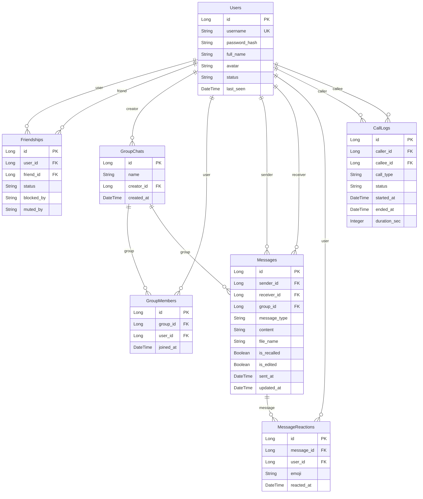
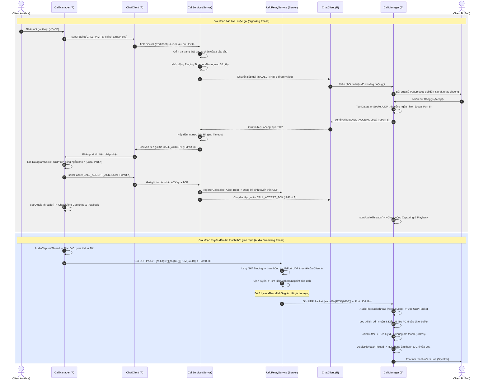
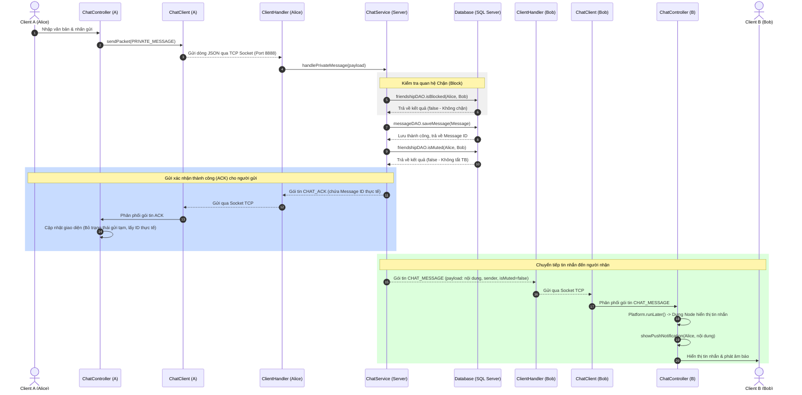
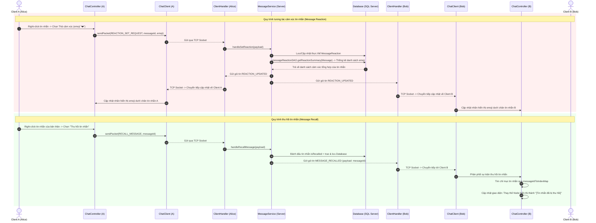

# CHƯƠNG TRÌNH CHI TIẾT VÀ GIẢI THÍCH TOÀN BỘ CODEBASE JAVACHATAPP

Tài liệu này cung cấp một bản phân tích chi tiết, đầy đủ và chuyên sâu về cấu trúc hệ thống, kiến trúc cơ sở dữ liệu, các luồng giao tiếp mạng và chi tiết từng lớp đối tượng (class), thuộc tính (field) và phương thức (method) trong toàn bộ mã nguồn của dự án **JavaChatApp**.

## MỤC LỤC CHÍNH

1. [Tổng Quan Kiến Trúc Hệ Thống](#1-tong-quan-kien-truc-he-thong)

2. [Thiết Kế Cơ Sở Dữ Liệu và Thực Thể (Hibernate Entities)](#2-thiet-ke-co-so-du-lieu-va-thuc-the-hibernate-entities)

3. [Giao Thức Truyền Tải Tín Hiệu TCP & Các Packet JSON](#3-giao-thuc-truyen-tai-tin-hieu-tcp-va-cac-packet-json)

4. [Kiến Trúc Gọi Thoại UDP Relay, Jitter Buffer & Heartbeat](#4-kien-truc-goi-thoai-udp-relay-jitter-buffer-heartbeat)

5. [Luồng Xử Lý Nghiệp Vụ Chính (Core Workflows)](#5-luong-xu-ly-nghiep-vu-chinh-core-workflows)

6. [Phân Tích Chi Tiết Từng Lớp Phía Server](#6-phan-tich-chi-tiet-tung-lop-phia-server)

7. [Phân Tích Chi Tiết Từng Lớp Phía Client](#7-phan-tich-chi-tiet-tung-lop-phia-client)

8. [Các Kỹ Thuật Tối Ưu Hóa Hiệu Năng Hàng Đầu](#8-cac-ky-thuat-toi-uu-hoa-hieu-nang-hang-dau)

9. [Chuẩn Hóa Comment Trong Codebase](#9-chuan-hoa-comment-trong-codebase)


---

## 1. TỔNG QUAN KIẾN TRÚC HỆ THỐNG

Hệ thống **JavaChatApp** được phát triển dưới dạng một ứng dụng trò chuyện thời gian thực Client-Server. Kiến trúc này được chia làm ba thành phần chính:

- **Chat Server**: Đóng vai trò là trung tâm điều phối tín hiệu. Server chạy một dịch vụ TCP socket để tiếp nhận và phản hồi các yêu cầu từ Client (như xác thực, gửi tin nhắn, cập nhật trạng thái bạn bè, quản lý nhóm và định tuyến cuộc gọi). Đồng thời, Server chạy một dịch vụ UDP Relay để làm cầu nối trung chuyển dữ liệu âm thanh trực tiếp giữa hai Client trong cuộc gọi thoại.

- **JavaFX Client**: Ứng dụng chạy trên thiết bị người dùng. JavaFX Client thiết lập một kết nối TCP duy nhất, liên tục đến Server để gửi/nhận dữ liệu dạng văn bản và tệp tin đa phương tiện. Khi có cuộc gọi thoại, Client tự khởi chạy các luồng UDP chạy ngầm để trao đổi luồng âm thanh trực tiếp thông qua Server UDP Relay.

- **Database (Microsoft SQL Server)**: Cơ sở dữ liệu quan hệ lưu trữ toàn bộ thông tin người dùng, quan hệ bạn bè, nhóm chat, lịch sử tin nhắn, lịch sử thả cảm xúc và nhật ký cuộc gọi. Máy chủ sử dụng thư viện **Hibernate** để làm cầu nối ORM, giúp tự động quản lý kết nối và ánh xạ bảng dữ liệu lên mã nguồn Java.


### 1.1 Sơ đồ hoạt động vật lý hệ thống (Physical System Architecture Diagram)


```text

+----------------------------------------+            +----------------------------------------+

|             CLIENT A (JavaFX)          |            |             CLIENT B (JavaFX)          |

|                                        |            |                                        |

|  +--------------+    +--------------+  |            |  +--------------+    +--------------+  |

|  |  ChatClient  |    | Audio threads|  |            |  |  ChatClient  |    | Audio threads|  |

|  +------+-------+    +------+-------+  |            |  +------+-------+    +------+-------+  |

+---------|-------------------|----------+            +---------|-------------------|----------+

          |                   |                                 |                   |

          | TCP               | UDP                             | TCP               | UDP

          | Signaling         | Audio                           | Signaling         | Audio

          | Port 8888         | Port 8889                       | Port 8888         | Port 8889

          ▼                   ▼                                 ▼                   ▼

+---------|-------------------|---------------------------------|-------------------|----------+

|         |                   |                                 |                   |          |

|  +------▼-------+    +------▼-------+                  +------▼-------+    +------▼-------+  |

|  |ClientHandler |    |              |                  |ClientHandler |    |              |  |

|  |   (TCP)      |    |              |                  |   (TCP)      |    |              |  |

|  +------+-------+    |              |                  +------+-------+    |              |  |

|         |            |  UdpRelay    |                         |            |  UdpRelay    |  |

|  +------▼-------+    |   Service    |                  +------▼-------+    |   Service    |  |

|  |  Services    |    |              |                  |  Services    |    |              |  |

|  +------+-------+    +------▲-------+                  +------+-------+    +------▲-------+  |

|         |                   |                                 |                   |          |

|  +------▼-------+           | (Relay mapping by callId)       +------▼-------+           |          |

|  |Hibernate Util|-----------+                                 |Hibernate Util|-----------+          |

|  +------+-------+                                             +------+-------+                       |

|         |                                                            |                               |

|  +------▼-------+                                             +------▼-------+                       |

|  | SQL Server   |                                             | SQL Server   |                       |

|  +--------------+                                             +--------------+                       |

|                                     CHAT SERVER                                              |

+----------------------------------------------------------------------------------------------+

```


---

## 2. THIẾT KẾ CƠ SỞ DỮ LIỆU VÀ THỰC THỂ (HIBERNATE ENTITIES)

Hệ thống định nghĩa 7 bảng dữ liệu quan hệ tương đương với 7 lớp Entity nằm trong package `org.example.common.model`. Dưới đây là chi tiết thiết kế của từng thực thể:


### 2.1 Sơ đồ mối quan hệ thực thể cơ sở dữ liệu (Database ER Diagram)





### 2.2 Thực thể User

Bảng `Users` lưu trữ thông tin về các tài khoản người dùng đăng ký vào hệ thống. Các thuộc tính chính bao gồm khóa chính `id` tự tăng, `username` độc nhất để đăng nhập, `passwordHash` lưu mật khẩu đã băm một chiều bằng BCrypt, `fullName` lưu tên hiển thị (kiểu NVARCHAR để hỗ trợ tiếng Việt có dấu), `avatar` lưu đường dẫn hoặc chuỗi ảnh đại diện, `status` biểu thị trạng thái ONLINE hoặc OFFLINE, `lastSeen` lưu thời gian hoạt động cuối cùng, `role` để phân quyền người dùng thông thường (`USER`) hoặc quản trị viên (`ADMIN`), và `locked` biểu thị tài khoản có đang bị khóa hay không.


### 2.2 Thực thể Message

Bảng `Messages` lưu trữ toàn bộ nội dung tin nhắn được trao đổi trong hệ thống. Nếu là tin nhắn riêng tư, trường `receiver_id` sẽ tham chiếu đến người nhận và trường `group_id` sẽ bằng `null`. Ngược lại, nếu là tin nhắn nhóm, trường `group_id` tham chiếu đến nhóm chat tương ứng và `receiver_id` sẽ bằng `null`. Cột `message_type` lưu kiểu tin nhắn gồm `TEXT` (văn bản), `IMAGE` (hình ảnh mã hóa Base64), `VOICE` (tin nhắn thoại ghi âm mã hóa Base64), `FILE` (tệp đính kèm Base64), hoặc `CALL_LOG` (nhật ký cuộc gọi kết thúc). Cột `content` có kiểu NVARCHAR(MAX) cho phép chứa nội dung văn bản hoặc chuỗi Base64 của ảnh/voice. Đặc biệt, để đảm bảo an toàn thông tin, trường `content` và `fileName` của thực thể này đã được áp dụng cơ chế tự động mã hóa AES-256 thông qua `MessageEncryptionConverter` trước khi lưu vào Database và tự động giải mã ngược trở lại khi truy vấn.


### 2.2 Thực thể Friendship

Bảng `Friendships` quản lý mối quan hệ bạn bè giữa hai thực thể người dùng. `user_id` là người chủ động gửi lời mời kết bạn, `friend_id` là người nhận. Cột `status` lưu trạng thái mối quan hệ (`PENDING` - đang chờ duyệt, `ACCEPTED` - đã đồng ý kết bạn). Cột `blockedBy` lưu danh sách các username đang thực hiện chặn đối phương, ngăn cấm họ gửi tin nhắn. Cột `mutedBy` lưu danh sách username đã tắt thông báo từ đối phương, giúp Client bỏ qua âm báo tin nhắn mới.


### 2.2 Thực thể GroupChat

Bảng `GroupChats` đại diện cho các phòng chat nhóm. Chứa khóa chính `id`, tên nhóm `name`, và `creator_id` tham chiếu đến người dùng đã tạo ra nhóm chat này.


### 2.2 Thực thể GroupMember

Bảng `GroupMembers` hoạt động như một bảng liên kết trung gian thiết lập mối quan hệ nhiều-nhiều giữa người dùng và nhóm chat. Mỗi bản ghi liên kết một thành viên (`user_id`) vào một nhóm chat cụ thể (`group_id`) kèm thời gian tham gia `joinedAt`.


### 2.2 Thực thể MessageReaction

Bảng `MessageReactions` lưu trữ cảm xúc thả emoji của từng người dùng đối với mỗi tin nhắn. Khóa ngoại `message_id` chỉ định tin nhắn được tác động, `user_id` chỉ định người thả cảm xúc, và `emoji` là biểu tượng cảm xúc dạng chuỗi biểu thị (ví dụ 👍, ❤️, 😂).


### 2.2 Thực thể CallLog

Bảng `CallLogs` lưu trữ nhật ký mọi cuộc gọi được thực hiện giữa hai người dùng. Bản ghi lưu thông tin người gọi `caller_id`, người nhận `callee_id`, loại cuộc gọi `callType` (`VOICE` hoặc `VIDEO`), trạng thái cuộc gọi khi kết thúc `status` (`COMPLETED`, `MISSED`, `REJECTED`, `CANCELED`), thời gian bắt đầu cuộc gọi `startedAt`, thời gian gác máy `endedAt`, và thời lượng đàm thoại thực tế tính bằng giây `durationSec`.


---

## 3. GIAO THỨC TRUYỀN TẢI TÍN HIỆU TCP & CÁC PACKET JSON

Toàn bộ các gói tin signaling và điều khiển văn bản đều truyền tải qua socket TCP trên cổng `8888`. Giao thức được đóng gói dưới dạng đối tượng JSON có hai trường cốt lõi là `type` và `payload`. Dưới đây là mô tả chi tiết của từng loại packet truyền thông trong hệ thống:


### 3.2 Gói tin `REGISTER_REQUEST`

- **Mô tả**: Client gửi lên Server để đăng ký tài khoản mới.

- **Ví dụ payload JSON**:
```json
{"username": "user1", "password": "password123", "fullName": "Nguyễn Văn A"}
```


### 3.2 Gói tin `REGISTER_SUCCESS`

- **Mô tả**: Server gửi về Client thông báo đăng ký thành công.

- **Ví dụ payload JSON**:
```json
"Registration successful!"
```


### 3.2 Gói tin `REGISTER_ERROR`

- **Mô tả**: Server thông báo đăng ký thất bại do tên tài khoản đã tồn tại hoặc lỗi CSDL.

- **Ví dụ payload JSON**:
```json
"Username already exists!"
```


### 3.2 Gói tin `LOGIN_REQUEST`

- **Mô tả**: Client gửi yêu cầu đăng nhập hệ thống.

- **Ví dụ payload JSON**:
```json
{"username": "user1", "password": "password123"}
```


### 3.2 Gói tin `LOGIN_SUCCESS`

- **Mô tả**: Server phản hồi đăng nhập thành công kèm thông tin lời chào.

- **Ví dụ payload JSON**:
```json
"Login successful! Welcome Nguyễn Văn A"
```


### 3.2 Gói tin `LOGIN_ERROR`

- **Mô tả**: Server từ chối đăng nhập do mật khẩu sai hoặc tài khoản bị khóa.

- **Ví dụ payload JSON**:
```json
"Incorrect username or password!"
```


### 3.2 Gói tin `LOAD_FRIENDS_REQUEST`

- **Mô tả**: Client yêu cầu danh sách bạn bè sau khi giao diện đã sẵn sàng.

- **Ví dụ payload JSON**:
```json
""
```


### 3.2 Gói tin `LOAD_FRIENDS_SUCCESS`

- **Mô tả**: Server trả về chi tiết danh sách bạn bè đã đồng ý, trạng thái online, và danh sách lời mời chờ duyệt.

- **Ví dụ payload JSON**:
```json
{"friends": [{"username": "friend1", "status": "ONLINE", "isBlockedByMe": false, "isMutedByMe": false}], "requests": ["waiting_user"]}
```


### 3.2 Gói tin `STATUS_UPDATE`

- **Mô tả**: Server thông báo trạng thái online/offline của một người bạn đến Client.

- **Ví dụ payload JSON**:
```json
"friend1:ONLINE"
```


### 3.2 Gói tin `PRIVATE_MESSAGE`

- **Mô tả**: Client gửi tin nhắn cá nhân đến một người bạn.

- **Ví dụ payload JSON**:
```json
{"receiver": "friend1", "content": "Hello", "type": "TEXT", "filename": null}
```


### 3.2 Gói tin `CHAT_ACK`

- **Mô tả**: Server xác nhận tin nhắn cá nhân đã lưu trữ thành công và gửi lại ID thực tế của tin nhắn cho người gửi.

- **Ví dụ payload JSON**:
```json
{"id": 105, "content": "Hello", "type": "TEXT", "filename": null, "receiver": "friend1"}
```


### 3.2 Gói tin `CHAT_MESSAGE`

- **Mô tả**: Server chuyển tiếp tin nhắn cá nhân đến cho Client người nhận.

- **Ví dụ payload JSON**:
```json
{"id": 105, "sender": "user1", "content": "Hello", "type": "TEXT", "filename": null, "isMuted": false}
```


### 3.2 Gói tin `GROUP_MESSAGE`

- **Mô tả**: Tương tự tin nhắn cá nhân nhưng truyền tải tin nhắn nhóm kèm ID nhóm chat.

- **Ví dụ payload JSON**:
```json
{"id": 204, "sender": "user1", "content": "Hello Group", "type": "TEXT", "filename": null, "groupId": 3}
```


### 3.2 Gói tin `LOAD_HISTORY_REQUEST`

- **Mô tả**: Client yêu cầu tải lịch sử chat riêng tư.

- **Ví dụ payload JSON**:
```json
{"otherUser": "friend1", "limit": 50}
```


### 3.2 Gói tin `CHAT_HISTORY`

- **Mô tả**: Server trả về mảng tin nhắn và nhật ký cuộc gọi cá nhân sắp xếp theo thời gian.

- **Ví dụ payload JSON**:
```json
{"otherUser": "friend1", "messages": [{"id": 105, "sender": "user1", "content": "Hello", "type": "TEXT", "timestamp": "2026-06-20T01:15:30"}]}
```


### 3.2 Gói tin `MESSAGE_RECALLED`

- **Mô tả**: Server thông báo một tin nhắn đã bị thu hồi.

- **Ví dụ payload JSON**:
```json
{"messageId": 105}
```


### 3.2 Gói tin `MESSAGE_EDITED`

- **Mô tả**: Server thông báo nội dung mới của một tin nhắn đã sửa đổi.

- **Ví dụ payload JSON**:
```json
{"messageId": 105, "newContent": "Hello (new)"}
```


### 3.2 Gói tin `REACTION_SET_REQUEST`

- **Mô tả**: Client yêu cầu thả emoji vào tin nhắn.

- **Ví dụ payload JSON**:
```json
{"messageId": 105, "emoji": "👍"}
```


### 3.2 Gói tin `REACTION_UPDATED`

- **Mô tả**: Server cập nhật tổng số lượng reaction mới nhất của tin nhắn cho các bên liên quan.

- **Ví dụ payload JSON**:
```json
{"messageId": 105, "reactions": [{"emoji": "👍", "count": 1, "users": ["user1"]}]}
```


### 3.2 Gói tin `FORCE_LOGOUT`

- **Mô tả**: Server ép buộc Client đăng xuất ngay lập tức do tài khoản đã bị khóa bởi quản trị viên.

- **Ví dụ payload JSON**:
```json
"Tài khoản của bạn đã bị khóa bởi Admin!"
```


### 3.2 Gói tin `CALL_INVITE`

- **Mô tả**: Client gửi lên để bắt đầu gọi điện hoặc Server chuyển tiếp yêu cầu gọi tới người nhận.

- **Ví dụ payload JSON**:
```json
{"from": "user1", "to": "friend1", "callId": "abc123ef", "type": "VOICE"}
```


### 3.2 Gói tin `CALL_ACCEPT`

- **Mô tả**: Người nhận chấp nhận cuộc gọi, gửi thông tin cổng UDP của mình lên Server.

- **Ví dụ payload JSON**:
```json
{"callId": "abc123ef", "ip": "192.168.1.5", "port": 52140}
```


### 3.2 Gói tin `CALL_ACCEPT_ACK`

- **Mô tả**: Người gọi phản hồi bắt tay, gửi cổng UDP của mình để thiết lập cuộc gọi hai chiều.

- **Ví dụ payload JSON**:
```json
{"callId": "abc123ef", "ip": "192.168.1.2", "port": 61245}
```


### 3.2 Gói tin `CALL_REJECT`

- **Mô tả**: Người nhận từ chối cuộc gọi.

- **Ví dụ payload JSON**:
```json
{"callId": "abc123ef", "reason": "USER_REJECT"}
```


### 3.2 Gói tin `CALL_CANCEL`

- **Mô tả**: Người gọi chủ động hủy cuộc gọi khi đang đổ chuông.

- **Ví dụ payload JSON**:
```json
{"callId": "abc123ef"}
```


### 3.2 Gói tin `CALL_END`

- **Mô tả**: Một trong hai bên cúp máy kết thúc cuộc gọi.

- **Ví dụ payload JSON**:
```json
{"callId": "abc123ef"}
```


### 3.2 Gói tin `CALL_BUSY`

- **Mô tả**: Người nhận tự động báo bận do đang trong một cuộc gọi khác.

- **Ví dụ payload JSON**:
```json
{"callId": "abc123ef"}
```


### 3.2 Gói tin `CALL_FAILED`

- **Mô tả**: Server báo lỗi thiết lập cuộc gọi (ví dụ: đối phương offline, bị chặn).

- **Ví dụ payload JSON**:
```json
{"callId": "abc123ef", "reason": "OFFLINE"}
```


---

## 4. KIẾN TRÚC GỌI THOẠI UDP RELAY, JITTER BUFFER & HEARTBEAT

Phần này trình bày sâu về cơ chế kỹ thuật xử lý âm thanh đàm thoại thời gian thực:


### 4.1 Luồng hoạt động của thiết bị âm thanh phía Client

- **Audio Capture**: Sử dụng lớp `AudioCaptureThread`. Thread này mở micro thông qua lớp `TargetDataLine` của thư viện Java Sound API. Dữ liệu âm thanh thô được ghi nhận ở định dạng PCM 16kHz, 16-bit, Mono. Cứ mỗi 20 mili-giây, luồng đọc ra một khối dữ liệu nhị phân kích thước 640 bytes. Để chuyển tiếp qua dịch vụ UDP Relay của Server, luồng chèn thêm 8 byte CallId ở đầu gói tin nhị phân và 4 byte Sequence Number, tạo thành một gói DatagramPacket có kích thước 652 bytes gửi lên cổng `8889` của máy chủ.

- **Audio Playback**: Sử dụng lớp `AudioPlaybackThread`. Thread này khởi chạy hai tiến trình con chạy song song. Một tiến trình `audio-receive` chịu trách nhiệm nhận gói tin UDP từ Server chuyển tiếp về, bóc tách sequence number, kiểm tra loại bỏ các gói tin đến trễ và đẩy vào bộ đệm `JitterBuffer`. Tiến trình thứ hai đọc dữ liệu âm thanh từ `JitterBuffer` định kỳ và ghi xuống thiết bị phát loa thông qua lớp `SourceDataLine` của Java Sound.


### 4.2 Cơ chế bộ đệm Jitter Buffer cục bộ

Lớp `JitterBuffer.java` giải quyết triệt để biến động trễ mạng của giao thức UDP:

- **Prebuffering**: Khi bắt đầu kết nối hoặc khi xảy ra hiện tượng cạn kiệt bộ đệm (underrun), JitterBuffer kích hoạt chế độ đệm trước. Hệ thống chỉ bắt đầu phát âm thanh ra loa sau khi hàng đợi đã tích lũy tối thiểu 5 khung âm thanh (tương đương 100ms âm thanh). Điều này tạo ra một khoảng đệm thời gian giúp bù đắp sự bất ổn định về độ trễ của các gói tin kế tiếp truyền qua Internet.

- **Che giấu mất gói (PLC)**: Nếu luồng phát âm thanh yêu cầu lấy gói dữ liệu mới nhưng bộ đệm rỗng, hàm `take()` sẽ tự động trả về bản sao của gói âm thanh nhận được trước đó (`lastFrame`) thay vì trả về null. Phương pháp lặp lại tín hiệu âm thanh này giúp triệt tiêu tiếng giật cục hoặc tiếng nổ lụp bụp gây ra bởi hiện tượng mất gói tin trên mạng LAN/WAN.


### 4.3 Heartbeat Monitor và Giám sát Kết nối

Trong quá trình thực hiện cuộc gọi, `CallManager` duy trì một tiến trình giám sát `heartbeatThread` chạy ngầm. Cứ mỗi giây, tiến trình kiểm tra số lượng gói tin âm thanh nhận được từ đối phương thông qua phương thức `playbackThread.getPacketsReceived()`. Nếu giá trị này không tăng trong vòng 5 giây liên tục, hệ thống coi như kết nối UDP giữa hai bên đã bị đứt gãy hoàn toàn (mất mạng, sập nguồn, v.v.). Lúc này, Client sẽ tự động phát gói tin `CALL_END` TCP lên máy chủ và kích hoạt hàm dọn dẹp để đóng cửa sổ cuộc gọi và giải phóng tài nguyên phần cứng mic/loa cục bộ.


### 4.4 Sơ đồ luồng thiết lập cuộc gọi và truyền tải âm thanh (VoIP Call Flow Diagram)





---

## 5. LUỒNG XỬ LÝ NGHIỆP VỤ CHÍNH (CORE WORKFLOWS)

Hệ thống tích hợp nhiều luồng xử lý phức tạp. Dưới đây là giải thích chi tiết về cách thức xử lý mã nguồn của từng luồng nghiệp vụ chính:


### 5.1 Luồng nhắn tin riêng tư & Tin nhắn nhóm

1. **Gửi tin nhắn**: Người dùng nhập tin nhắn và bấm gửi. Client tạo đối tượng `Packet` kiểu `PRIVATE_MESSAGE` hoặc `GROUP_MESSAGE` gửi qua TCP.

2. **Xử lý tại Server**: `ClientHandler` tiếp nhận và điều hướng đến `ChatService`. `ChatService` kiểm tra xem người gửi có bị người nhận chặn (`Friendship.blockedBy`) hay không. Nếu bị chặn, Server phản hồi lại gói tin lỗi `CHAT_ERROR` về Client người gửi.

3. **Lưu trữ CSDL**: Nếu không bị chặn, Server tạo thực thể `Message` mới, lưu xuống database qua `MessageDAO.saveMessage`. Trong quá trình này, JPA `AttributeConverter` (`MessageEncryptionConverter`) sẽ tự động mã hóa nội dung cột `content` và `fileName` của tin nhắn bằng AES-256 (có tiền tố `enc:`) trước khi ghi xuống đĩa. Khi cần lấy dữ liệu tin nhắn, Hibernate sẽ tự động giải mã ngược về dạng thô (plain-text) trước khi đưa vào Entity để hiển thị hoặc gửi tiếp. Dữ liệu tin nhắn cũ chưa mã hóa vẫn được tương thích tốt.

4. **ACK & Chuyển tiếp**: Server gửi lại gói tin `CHAT_ACK` hay `GROUP_MESSAGE_ACK` chứa ID thực tế của tin nhắn về cho người gửi. Đồng thời, Server tìm kiếm Handler kết nối TCP của người nhận. Nếu người nhận đang trực tuyến, Server gửi gói tin `CHAT_MESSAGE` hoặc `GROUP_MESSAGE` đến người nhận. Nếu người nhận đã tắt thông báo đối phương (`Friendship.mutedBy`), gói tin sẽ được đính kèm cờ `isMuted = true` để Client người nhận không hiển thị popup thông báo và tắt âm báo.


#### Sơ đồ luồng nhắn tin riêng tư (Private Chat Flow Diagram)





### 5.2 Luồng hiển thị Hội thoại gần đây (Recent Conversations)

- **Xây dựng danh sách**: Khi khởi chạy giao diện chat, Client gửi gói tin `CONVERSATION_LIST_REQUEST`. Server quét toàn bộ bảng tin nhắn có sự tham gia của người dùng hiện tại thông qua `MessageDAO.getConversationMessages`.

- **Sắp xếp thời gian**: Server gom nhóm các tin nhắn theo cặp đối tác chat hoặc theo ID nhóm. Đối với mỗi hội thoại, Server chỉ lấy tin nhắn mới nhất để làm tin nhắn xem trước (preview) và thời gian tương tác. Kết quả được sắp xếp theo thời gian gửi tin nhắn giảm dần.

- **Đồng bộ giao diện**: Client nhận được danh sách dưới dạng mảng JSON và đẩy vào danh sách hiển thị `recentConversations`. Mỗi khi gửi tin nhắn mới thành công hoặc nhận được tin nhắn đến, hàm `addToRecentConversations()` trên Client sẽ được kích hoạt để cập nhật nội dung xem trước và đẩy hội thoại tương ứng lên trên đầu danh sách.


### 5.3 Luồng tương tác nâng cao (Message Reaction, Recall & Edit)

- **Phản hồi cảm xúc**: Người dùng click biểu tượng emoji trên tin nhắn -> gửi `REACTION_SET_REQUEST`. Server cập nhật DB thông qua `MessageReactionDAO`, truy vấn tổng hợp số lượng reactions của tin nhắn đó, sau đó gửi lại gói `REACTION_UPDATED` cho cả hai client để đồng bộ giao diện hiển thị emoji dưới chân tin nhắn.

- **Thu hồi tin nhắn**: Người dùng click chọn 'Thu hồi' -> gửi `RECALL_MESSAGE`. Server đánh dấu tin nhắn `isRecalled = true` trong database, rồi gửi gói `MESSAGE_RECALLED` cho người nhận. Khung chat Client của cả hai bên cập nhật lại bong bóng tin nhắn hiển thị chuỗi `[Tin nhắn đã bị thu hồi]`.

- **Chỉnh sửa tin nhắn**: Người dùng click chọn 'Chỉnh sửa' -> gửi `EDIT_MESSAGE` chứa nội dung mới. Server cập nhật database, đổi cờ `isEdited = true` và gửi gói `MESSAGE_EDITED` chứa nội dung mới cho người nhận để hiển thị hậu tố `(Đã chỉnh sửa)`.


#### Sơ đồ quy trình tương tác nâng cao (Reaction & Recall Flow Diagram)





### 5.4 Luồng Chặn & Tắt thông báo người dùng

- **Thực hiện Chặn**: Khi người dùng nhấn nút chặn một người bạn, Client gửi gói tin `BLOCK_USER_REQUEST` kèm tên đối phương. Server gọi `FriendService.handleBlockUser`. Dịch vụ này cập nhật mối quan hệ bạn bè trong database bằng cách nối thêm tên tài khoản của người chặn vào trường `blockedBy` của bảng `Friendships`.

- **Mở chặn**: Tương tự như chặn, khi nhấn bỏ chặn, Server loại bỏ tên tài khoản của người chặn ra khỏi chuỗi `blockedBy` của bản ghi trong database.

- **Tắt thông báo**: Hoạt động tương tự như cơ chế chặn nhưng thông tin được cập nhật vào trường `mutedBy` của bảng `Friendships`.


---

## 6. PHÂN TÍCH CHI TIẾT TỪNG LỚP PHÍA SERVER

Phần này phân tích chi tiết từng lớp mã nguồn phía Server, liệt kê toàn bộ các thuộc tính và phương thức xử lý chính:


### 6.1 Lớp `ServerApplication` (class)

- **Đường dẫn**: `c:/Users/XIAOXIN/IdeaProjects/JavaChatApp/src/main/java/org/example/server/ServerApplication.java`

- **Package**: `org.example.server`

- **Thuộc tính**: Không có thuộc tính riêng.

- **Các phương thức xử lý**:

  - Phương thức `main(String[] args)` $\rightarrow$ Kiểu trả về: `void`

    * *Ý nghĩa*: Xử lý nghiệp vụ điều hướng dữ liệu hoặc thực hiện truy vấn cơ sở dữ liệu.


### 6.1 Lớp `CallLogDAO` (class)

- **Đường dẫn**: `c:/Users/XIAOXIN/IdeaProjects/JavaChatApp/src/main/java/org/example/server/dao/CallLogDAO.java`

- **Package**: `org.example.server.dao`

- **Thuộc tính**: Không có thuộc tính riêng.

- **Các phương thức xử lý**:

  - Phương thức `save(CallLog callLog)` $\rightarrow$ Kiểu trả về: `boolean`

    * *Ý nghĩa*: Thực hiện ghi, cập nhật hoặc xóa bản ghi dữ liệu trong Database sử dụng Hibernate Transaction.

  - Phương thức `getCallHistory(User user, int limit)` $\rightarrow$ Kiểu trả về: `List<CallLog>`

    * *Ý nghĩa*: Xử lý nghiệp vụ điều hướng dữ liệu hoặc thực hiện truy vấn cơ sở dữ liệu.

  - Phương thức `getCallHistoryBetween(User user1, User user2, int limit)` $\rightarrow$ Kiểu trả về: `List<CallLog>`

    * *Ý nghĩa*: Xử lý nghiệp vụ điều hướng dữ liệu hoặc thực hiện truy vấn cơ sở dữ liệu.


### 6.1 Lớp `FriendshipDAO` (class)

- **Đường dẫn**: `c:/Users/XIAOXIN/IdeaProjects/JavaChatApp/src/main/java/org/example/server/dao/FriendshipDAO.java`

- **Package**: `org.example.server.dao`

- **Thuộc tính**: Không có thuộc tính riêng.

- **Các phương thức xử lý**:

  - Phương thức `saveFriendship(Friendship friendship)` $\rightarrow$ Kiểu trả về: `boolean`

    * *Ý nghĩa*: Thực hiện ghi, cập nhật hoặc xóa bản ghi dữ liệu trong Database sử dụng Hibernate Transaction.

  - Phương thức `updateFriendship(Friendship friendship)` $\rightarrow$ Kiểu trả về: `boolean`

    * *Ý nghĩa*: Thực hiện ghi, cập nhật hoặc xóa bản ghi dữ liệu trong Database sử dụng Hibernate Transaction.

  - Phương thức `updateBlockStatus(User user1, User user2, String blockedBy)` $\rightarrow$ Kiểu trả về: `boolean`

    * *Ý nghĩa*: Thực hiện ghi, cập nhật hoặc xóa bản ghi dữ liệu trong Database sử dụng Hibernate Transaction.

  - Phương thức `updateMuteStatus(User user1, User user2, String mutedBy)` $\rightarrow$ Kiểu trả về: `boolean`

    * *Ý nghĩa*: Thực hiện ghi, cập nhật hoặc xóa bản ghi dữ liệu trong Database sử dụng Hibernate Transaction.

  - Phương thức `findFriendship(User user1, User user2)` $\rightarrow$ Kiểu trả về: `Friendship`

    * *Ý nghĩa*: Thực hiện truy vấn Database thông qua Hibernate Session để tìm kiếm thông tin tương ứng.

  - Phương thức `getAcceptedFriends(User user)` $\rightarrow$ Kiểu trả về: `List<Friendship>`

    * *Ý nghĩa*: Xử lý nghiệp vụ điều hướng dữ liệu hoặc thực hiện truy vấn cơ sở dữ liệu.

  - Phương thức `getPendingRequests(User user)` $\rightarrow$ Kiểu trả về: `List<Friendship>`

    * *Ý nghĩa*: Xử lý nghiệp vụ điều hướng dữ liệu hoặc thực hiện truy vấn cơ sở dữ liệu.

  - Phương thức `isBlocked(User sender, User receiver)` $\rightarrow$ Kiểu trả về: `boolean`

    * *Ý nghĩa*: Xử lý nghiệp vụ điều hướng dữ liệu hoặc thực hiện truy vấn cơ sở dữ liệu.

  - Phương thức `isMuted(User sender, User receiver)` $\rightarrow$ Kiểu trả về: `boolean`

    * *Ý nghĩa*: Xử lý nghiệp vụ điều hướng dữ liệu hoặc thực hiện truy vấn cơ sở dữ liệu.

  - Phương thức `getAllFriendships(User user)` $\rightarrow$ Kiểu trả về: `List<Friendship>`

    * *Ý nghĩa*: Xử lý nghiệp vụ điều hướng dữ liệu hoặc thực hiện truy vấn cơ sở dữ liệu.


### 6.1 Lớp `GroupDAO` (class)

- **Đường dẫn**: `c:/Users/XIAOXIN/IdeaProjects/JavaChatApp/src/main/java/org/example/server/dao/GroupDAO.java`

- **Package**: `org.example.server.dao`

- **Thuộc tính**: Không có thuộc tính riêng.

- **Các phương thức xử lý**:

  - Phương thức `save(GroupChat groupChat)` $\rightarrow$ Kiểu trả về: `boolean`

    * *Ý nghĩa*: Thực hiện ghi, cập nhật hoặc xóa bản ghi dữ liệu trong Database sử dụng Hibernate Transaction.

  - Phương thức `findById(Long id)` $\rightarrow$ Kiểu trả về: `GroupChat`

    * *Ý nghĩa*: Thực hiện truy vấn Database thông qua Hibernate Session để tìm kiếm thông tin tương ứng.

  - Phương thức `getGroupsOfUser(User user)` $\rightarrow$ Kiểu trả về: `List<GroupChat>`

    * *Ý nghĩa*: Xử lý nghiệp vụ điều hướng dữ liệu hoặc thực hiện truy vấn cơ sở dữ liệu.


### 6.1 Lớp `GroupMemberDAO` (class)

- **Đường dẫn**: `c:/Users/XIAOXIN/IdeaProjects/JavaChatApp/src/main/java/org/example/server/dao/GroupMemberDAO.java`

- **Package**: `org.example.server.dao`

- **Thuộc tính**: Không có thuộc tính riêng.

- **Các phương thức xử lý**:

  - Phương thức `save(GroupMember groupMember)` $\rightarrow$ Kiểu trả về: `boolean`

    * *Ý nghĩa*: Thực hiện ghi, cập nhật hoặc xóa bản ghi dữ liệu trong Database sử dụng Hibernate Transaction.

  - Phương thức `isMember(GroupChat groupChat, User user)` $\rightarrow$ Kiểu trả về: `boolean`

    * *Ý nghĩa*: Xử lý nghiệp vụ điều hướng dữ liệu hoặc thực hiện truy vấn cơ sở dữ liệu.

  - Phương thức `getMembers(GroupChat groupChat)` $\rightarrow$ Kiểu trả về: `List<User>`

    * *Ý nghĩa*: Xử lý nghiệp vụ điều hướng dữ liệu hoặc thực hiện truy vấn cơ sở dữ liệu.


### 6.1 Lớp `MessageDAO` (class)

- **Đường dẫn**: `c:/Users/XIAOXIN/IdeaProjects/JavaChatApp/src/main/java/org/example/server/dao/MessageDAO.java`

- **Package**: `org.example.server.dao`

- **Thuộc tính**: Không có thuộc tính riêng.

- **Các phương thức xử lý**:

  - Phương thức `saveMessage(Message message)` $\rightarrow$ Kiểu trả về: `boolean`

    * *Ý nghĩa*: Thực hiện ghi, cập nhật hoặc xóa bản ghi dữ liệu trong Database sử dụng Hibernate Transaction.

  - Phương thức `updateMessage(Message message)` $\rightarrow$ Kiểu trả về: `boolean`

    * *Ý nghĩa*: Thực hiện ghi, cập nhật hoặc xóa bản ghi dữ liệu trong Database sử dụng Hibernate Transaction.

  - Phương thức `findById(Long id)` $\rightarrow$ Kiểu trả về: `Message`

    * *Ý nghĩa*: Thực hiện truy vấn Database thông qua Hibernate Session để tìm kiếm thông tin tương ứng.

  - Phương thức `getPrivateHistory(User user1, User user2, int limit)` $\rightarrow$ Kiểu trả về: `List<Message>`

    * *Ý nghĩa*: Xử lý nghiệp vụ điều hướng dữ liệu hoặc thực hiện truy vấn cơ sở dữ liệu.

  - Phương thức `getGroupHistory(GroupChat groupChat, int limit)` $\rightarrow$ Kiểu trả về: `List<Message>`

    * *Ý nghĩa*: Xử lý nghiệp vụ điều hướng dữ liệu hoặc thực hiện truy vấn cơ sở dữ liệu.

  - Phương thức `getConversationMessages(User user)` $\rightarrow$ Kiểu trả về: `List<Message>`

    * *Ý nghĩa*: Xử lý nghiệp vụ điều hướng dữ liệu hoặc thực hiện truy vấn cơ sở dữ liệu.


### 6.1 Lớp `MessageReactionDAO` (class)

- **Đường dẫn**: `c:/Users/XIAOXIN/IdeaProjects/JavaChatApp/src/main/java/org/example/server/dao/MessageReactionDAO.java`

- **Package**: `org.example.server.dao`

- **Thuộc tính**: Không có thuộc tính riêng.

- **Các phương thức xử lý**:

  - Phương thức `findByMessageAndUser(Message message, User user)` $\rightarrow$ Kiểu trả về: `MessageReaction`

    * *Ý nghĩa*: Thực hiện truy vấn Database thông qua Hibernate Session để tìm kiếm thông tin tương ứng.

  - Phương thức `saveOrUpdate(MessageReaction reaction)` $\rightarrow$ Kiểu trả về: `boolean`

    * *Ý nghĩa*: Thực hiện ghi, cập nhật hoặc xóa bản ghi dữ liệu trong Database sử dụng Hibernate Transaction.

  - Phương thức `delete(MessageReaction reaction)` $\rightarrow$ Kiểu trả về: `boolean`

    * *Ý nghĩa*: Thực hiện ghi, cập nhật hoặc xóa bản ghi dữ liệu trong Database sử dụng Hibernate Transaction.

  - Phương thức `getReactionSummary(Message message)` $\rightarrow$ Kiểu trả về: `JsonArray`

    * *Ý nghĩa*: Xử lý nghiệp vụ điều hướng dữ liệu hoặc thực hiện truy vấn cơ sở dữ liệu.


### 6.1 Lớp `UserDAO` (class)

- **Đường dẫn**: `c:/Users/XIAOXIN/IdeaProjects/JavaChatApp/src/main/java/org/example/server/dao/UserDAO.java`

- **Package**: `org.example.server.dao`

- **Thuộc tính**: Không có thuộc tính riêng.

- **Các phương thức xử lý**:

  - Phương thức `findByUsername(String username)` $\rightarrow$ Kiểu trả về: `User`

    * *Ý nghĩa*: Thực hiện truy vấn Database thông qua Hibernate Session để tìm kiếm thông tin tương ứng.

  - Phương thức `saveUser(User user)` $\rightarrow$ Kiểu trả về: `boolean`

    * *Ý nghĩa*: Thực hiện ghi, cập nhật hoặc xóa bản ghi dữ liệu trong Database sử dụng Hibernate Transaction.

  - Phương thức `updateUserStatus(String username, String status)` $\rightarrow$ Kiểu trả về: `void`

    * *Ý nghĩa*: Thực hiện ghi, cập nhật hoặc xóa bản ghi dữ liệu trong Database sử dụng Hibernate Transaction.

  - Phương thức `updateUser(User user)` $\rightarrow$ Kiểu trả về: `boolean`

    * *Ý nghĩa*: Thực hiện ghi, cập nhật hoặc xóa bản ghi dữ liệu trong Database sử dụng Hibernate Transaction.


### 6.1 Lớp `ClientHandler` (class)

- **Đường dẫn**: `c:/Users/XIAOXIN/IdeaProjects/JavaChatApp/src/main/java/org/example/server/network/ClientHandler.java`

- **Package**: `org.example.server.network`

- **Các thuộc tính chính**:

  - `socket` (Kiểu dữ liệu: `Socket`)

  - `out` (Kiểu dữ liệu: `PrintWriter`)

  - `in` (Kiểu dữ liệu: `BufferedReader`)

  - `currentUsername` (Kiểu dữ liệu: `String`)

  - `authService` (Kiểu dữ liệu: `AuthService`)

  - `chatService` (Kiểu dữ liệu: `ChatService`)

  - `messageService` (Kiểu dữ liệu: `MessageService`)

  - `friendService` (Kiểu dữ liệu: `FriendService`)

  - `callService` (Kiểu dữ liệu: `CallService`)

  - `adminService` (Kiểu dữ liệu: `AdminService`)

- **Các phương thức xử lý**:

  - Phương thức `run()` $\rightarrow$ Kiểu trả về: `void`

    * *Ý nghĩa*: Xử lý nghiệp vụ điều hướng dữ liệu hoặc thực hiện truy vấn cơ sở dữ liệu.

  - Phương thức `handlePacket(Packet packet)` $\rightarrow$ Kiểu trả về: `void`

    * *Ý nghĩa*: Phân tích loại gói tin nhận được và điều phối xử lý đến các lớp dịch vụ (Service) thích hợp.

  - Phương thức `sendPacket(Packet packet)` $\rightarrow$ Kiểu trả về: `void`

    * *Ý nghĩa*: Mã hóa đối tượng gói tin sang chuỗi JSON và ghi trực tiếp xuống luồng đầu ra Socket TCP gửi về Client.

  - Phương thức `disconnect()` $\rightarrow$ Kiểu trả về: `void`

    * *Ý nghĩa*: Thực hiện ngắt kết nối an toàn cho Client, dọn dẹp tài nguyên cuộc gọi và cập nhật trạng thái ngoại tuyến.

  - Phương thức `getCurrentUsername()` $\rightarrow$ Kiểu trả về: `String`

    * *Ý nghĩa*: Xử lý nghiệp vụ điều hướng dữ liệu hoặc thực hiện truy vấn cơ sở dữ liệu.

  - Phương thức `setCurrentUsername(String currentUsername)` $\rightarrow$ Kiểu trả về: `void`

    * *Ý nghĩa*: Xử lý nghiệp vụ điều hướng dữ liệu hoặc thực hiện truy vấn cơ sở dữ liệu.


### 6.1 Lớp `ServerManager` (class)

- **Đường dẫn**: `c:/Users/XIAOXIN/IdeaProjects/JavaChatApp/src/main/java/org/example/server/network/ServerManager.java`

- **Package**: `org.example.server.network`

- **Các thuộc tính chính**:

  - `PORT` (Kiểu dữ liệu: `int`)

  - `threadPool` (Kiểu dữ liệu: `ExecutorService`)

  - `activeClients` (Kiểu dữ liệu: `List<ClientHandler>`)

  - `callService` (Kiểu dữ liệu: `CallService`)

  - `udpRelayService` (Kiểu dữ liệu: `UdpRelayService`)

- **Các phương thức xử lý**:

  - Phương thức `getCallService()` $\rightarrow$ Kiểu trả về: `CallService`

    * *Ý nghĩa*: Xử lý nghiệp vụ điều hướng dữ liệu hoặc thực hiện truy vấn cơ sở dữ liệu.

  - Phương thức `getUdpRelayService()` $\rightarrow$ Kiểu trả về: `UdpRelayService`

    * *Ý nghĩa*: Xử lý nghiệp vụ điều hướng dữ liệu hoặc thực hiện truy vấn cơ sở dữ liệu.

  - Phương thức `startServer()` $\rightarrow$ Kiểu trả về: `void`

    * *Ý nghĩa*: Khởi chạy máy chủ chính, bắt đầu lắng nghe cổng TCP 8888 và khởi động dịch vụ UDP Relay.

  - Phương thức `getActiveClients()` $\rightarrow$ Kiểu trả về: `List<ClientHandler>`

    * *Ý nghĩa*: Xử lý nghiệp vụ điều hướng dữ liệu hoặc thực hiện truy vấn cơ sở dữ liệu.

  - Phương thức `removeClient(ClientHandler clientHandler)` $\rightarrow$ Kiểu trả về: `void`

    * *Ý nghĩa*: Xử lý nghiệp vụ điều hướng dữ liệu hoặc thực hiện truy vấn cơ sở dữ liệu.

  - Phương thức `broadcastOnlineStatus(String username, boolean isOnline, Set<String> friendUsernames)` $\rightarrow$ Kiểu trả về: `void`

    * *Ý nghĩa*: Xử lý nghiệp vụ điều hướng dữ liệu hoặc thực hiện truy vấn cơ sở dữ liệu.

  - Phương thức `broadcastOnlineStatus(String username, boolean isOnline)` $\rightarrow$ Kiểu trả về: `void`

    * *Ý nghĩa*: Xử lý nghiệp vụ điều hướng dữ liệu hoặc thực hiện truy vấn cơ sở dữ liệu.

  - Phương thức `sendToClient(String username, Packet packet)` $\rightarrow$ Kiểu trả về: `void`

    * *Ý nghĩa*: Xử lý nghiệp vụ điều hướng dữ liệu hoặc thực hiện truy vấn cơ sở dữ liệu.

  - Phương thức `getClientHandler(String username)` $\rightarrow$ Kiểu trả về: `ClientHandler`

    * *Ý nghĩa*: Xử lý nghiệp vụ điều hướng dữ liệu hoặc thực hiện truy vấn cơ sở dữ liệu.

  - Phương thức `broadcastPacket(Packet packet, ClientHandler excludeClient)` $\rightarrow$ Kiểu trả về: `void`

    * *Ý nghĩa*: Xử lý nghiệp vụ điều hướng dữ liệu hoặc thực hiện truy vấn cơ sở dữ liệu.


### 6.1 Lớp `UdpRelayService` (class)

- **Đường dẫn**: `c:/Users/XIAOXIN/IdeaProjects/JavaChatApp/src/main/java/org/example/server/network/UdpRelayService.java`

- **Package**: `org.example.server.network`

- **Các thuộc tính chính**:

  - `RELAY_PORT` (Kiểu dữ liệu: `int`)

  - `CALL_ID_LENGTH` (Kiểu dữ liệu: `int`)

  - `MAX_PACKET_SIZE` (Kiểu dữ liệu: `int`)

  - `relaySocket` (Kiểu dữ liệu: `DatagramSocket`)

  - `relayThread` (Kiểu dữ liệu: `Thread`)

- **Các phương thức xử lý**:

  - Phương thức `start()` $\rightarrow$ Kiểu trả về: `void`

    * *Ý nghĩa*: Xử lý nghiệp vụ điều hướng dữ liệu hoặc thực hiện truy vấn cơ sở dữ liệu.

  - Phương thức `stop()` $\rightarrow$ Kiểu trả về: `void`

    * *Ý nghĩa*: Xử lý nghiệp vụ điều hướng dữ liệu hoặc thực hiện truy vấn cơ sở dữ liệu.

  - Phương thức `registerCall(String callId, String callerUsername, String calleeUsername)` $\rightarrow$ Kiểu trả về: `void`

    * *Ý nghĩa*: Xử lý nghiệp vụ điều hướng dữ liệu hoặc thực hiện truy vấn cơ sở dữ liệu.

  - Phương thức `unregisterCall(String callId)` $\rightarrow$ Kiểu trả về: `void`

    * *Ý nghĩa*: Xử lý nghiệp vụ điều hướng dữ liệu hoặc thực hiện truy vấn cơ sở dữ liệu.

  - Phương thức `getRelayPort()` $\rightarrow$ Kiểu trả về: `int`

    * *Ý nghĩa*: Xử lý nghiệp vụ điều hướng dữ liệu hoặc thực hiện truy vấn cơ sở dữ liệu.

  - Phương thức `relayLoop()` $\rightarrow$ Kiểu trả về: `void`

    * *Ý nghĩa*: Xử lý nghiệp vụ điều hướng dữ liệu hoặc thực hiện truy vấn cơ sở dữ liệu.


### 6.1 Lớp `AdminService` (class)

- **Đường dẫn**: `c:/Users/XIAOXIN/IdeaProjects/JavaChatApp/src/main/java/org/example/server/service/AdminService.java`

- **Package**: `org.example.server.service`

- **Các thuộc tính chính**:

  - `userDAO` (Kiểu dữ liệu: `UserDAO`)

  - `serverManager` (Kiểu dữ liệu: `ServerManager`)

  - `gson` (Kiểu dữ liệu: `Gson`)

- **Các phương thức xử lý**:

  - Phương thức `handleGetUsers(ClientHandler client)` $\rightarrow$ Kiểu trả về: `void`

    * *Ý nghĩa*: Tiếp nhận và xử lý nghiệp vụ cho yêu cầu dạng `GETUSERS` gửi từ Client.

  - Phương thức `handleCreateUser(String payload, ClientHandler client)` $\rightarrow$ Kiểu trả về: `void`

    * *Ý nghĩa*: Tiếp nhận và xử lý nghiệp vụ cho yêu cầu dạng `CREATEUSER` gửi từ Client.

  - Phương thức `handleUpdateUser(String payload, ClientHandler client)` $\rightarrow$ Kiểu trả về: `void`

    * *Ý nghĩa*: Tiếp nhận và xử lý nghiệp vụ cho yêu cầu dạng `UPDATEUSER` gửi từ Client.

  - Phương thức `handleResetPassword(String payload, ClientHandler client)` $\rightarrow$ Kiểu trả về: `void`

    * *Ý nghĩa*: Tiếp nhận và xử lý nghiệp vụ cho yêu cầu dạng `RESETPASSWORD` gửi từ Client.

  - Phương thức `handleToggleLock(String payload, ClientHandler client)` $\rightarrow$ Kiểu trả về: `void`

    * *Ý nghĩa*: Tiếp nhận và xử lý nghiệp vụ cho yêu cầu dạng `TOGGLELOCK` gửi từ Client.

  - Phương thức `forceDisconnectUser(String username)` $\rightarrow$ Kiểu trả về: `void`

    * *Ý nghĩa*: Xử lý nghiệp vụ điều hướng dữ liệu hoặc thực hiện truy vấn cơ sở dữ liệu.


### 6.1 Lớp `AuthService` (class)

- **Đường dẫn**: `c:/Users/XIAOXIN/IdeaProjects/JavaChatApp/src/main/java/org/example/server/service/AuthService.java`

- **Package**: `org.example.server.service`

- **Các thuộc tính chính**:

  - `userDAO` (Kiểu dữ liệu: `UserDAO`)

  - `friendshipDAO` (Kiểu dữ liệu: `FriendshipDAO`)

  - `serverManager` (Kiểu dữ liệu: `ServerManager`)

- **Các phương thức xử lý**:

  - Phương thức `handleRegister(String payload, ClientHandler client)` $\rightarrow$ Kiểu trả về: `void`

    * *Ý nghĩa*: Tiếp nhận và xử lý nghiệp vụ cho yêu cầu dạng `REGISTER` gửi từ Client.

  - Phương thức `handleLogin(String payload, ClientHandler client)` $\rightarrow$ Kiểu trả về: `void`

    * *Ý nghĩa*: Tiếp nhận và xử lý nghiệp vụ cho yêu cầu dạng `LOGIN` gửi từ Client.

  - Phương thức `handleLogout(ClientHandler client)` $\rightarrow$ Kiểu trả về: `void`

    * *Ý nghĩa*: Tiếp nhận và xử lý nghiệp vụ cho yêu cầu dạng `LOGOUT` gửi từ Client.

  - Phương thức `getFriendUsernames(User user)` $\rightarrow$ Kiểu trả về: `Set<String>`

    * *Ý nghĩa*: Xử lý nghiệp vụ điều hướng dữ liệu hoặc thực hiện truy vấn cơ sở dữ liệu.

  - Phương thức `handleGetUserInfo(ClientHandler client)` $\rightarrow$ Kiểu trả về: `void`

    * *Ý nghĩa*: Tiếp nhận và xử lý nghiệp vụ cho yêu cầu dạng `GETUSERINFO` gửi từ Client.


### 6.1 Lớp `CallService` (class)

- **Đường dẫn**: `c:/Users/XIAOXIN/IdeaProjects/JavaChatApp/src/main/java/org/example/server/service/CallService.java`

- **Package**: `org.example.server.service`

- **Các thuộc tính chính**:

  - `serverManager` (Kiểu dữ liệu: `ServerManager`)

  - `friendshipDAO` (Kiểu dữ liệu: `FriendshipDAO`)

  - `userDAO` (Kiểu dữ liệu: `UserDAO`)

  - `callLogDAO` (Kiểu dữ liệu: `CallLogDAO`)

  - `timeoutExecutor` (Kiểu dữ liệu: `ScheduledExecutorService`)

- **Các phương thức xử lý**:

  - Phương thức `handleInvite(String payload, ClientHandler callerClient)` $\rightarrow$ Kiểu trả về: `void`

    * *Ý nghĩa*: Tiếp nhận và xử lý nghiệp vụ cho yêu cầu dạng `INVITE` gửi từ Client.

  - Phương thức `handleAccept(String payload, ClientHandler calleeClient)` $\rightarrow$ Kiểu trả về: `void`

    * *Ý nghĩa*: Tiếp nhận và xử lý nghiệp vụ cho yêu cầu dạng `ACCEPT` gửi từ Client.

  - Phương thức `handleAcceptAck(String payload, ClientHandler callerClient)` $\rightarrow$ Kiểu trả về: `void`

    * *Ý nghĩa*: Tiếp nhận và xử lý nghiệp vụ cho yêu cầu dạng `ACCEPTACK` gửi từ Client.

  - Phương thức `handleReject(String payload, ClientHandler calleeClient)` $\rightarrow$ Kiểu trả về: `void`

    * *Ý nghĩa*: Tiếp nhận và xử lý nghiệp vụ cho yêu cầu dạng `REJECT` gửi từ Client.

  - Phương thức `handleCancel(String payload, ClientHandler callerClient)` $\rightarrow$ Kiểu trả về: `void`

    * *Ý nghĩa*: Tiếp nhận và xử lý nghiệp vụ cho yêu cầu dạng `CANCEL` gửi từ Client.

  - Phương thức `handleEnd(String payload, ClientHandler client)` $\rightarrow$ Kiểu trả về: `void`

    * *Ý nghĩa*: Tiếp nhận và xử lý nghiệp vụ cho yêu cầu dạng `END` gửi từ Client.

  - Phương thức `handleClientDisconnect(String username)` $\rightarrow$ Kiểu trả về: `void`

    * *Ý nghĩa*: Tiếp nhận và xử lý nghiệp vụ cho yêu cầu dạng `CLIENTDISCONNECT` gửi từ Client.

  - Phương thức `cleanup(String callId, String status)` $\rightarrow$ Kiểu trả về: `void`

    * *Ý nghĩa*: Xử lý nghiệp vụ điều hướng dữ liệu hoặc thực hiện truy vấn cơ sở dữ liệu.

  - Phương thức `cancelTimeout(String callId)` $\rightarrow$ Kiểu trả về: `void`

    * *Ý nghĩa*: Xử lý nghiệp vụ điều hướng dữ liệu hoặc thực hiện truy vấn cơ sở dữ liệu.

  - Phương thức `sendFailed(ClientHandler client, String callId, String reason)` $\rightarrow$ Kiểu trả về: `void`

    * *Ý nghĩa*: Xử lý nghiệp vụ điều hướng dữ liệu hoặc thực hiện truy vấn cơ sở dữ liệu.

  - Phương thức `log(String callId, String msg)` $\rightarrow$ Kiểu trả về: `void`

    * *Ý nghĩa*: Xử lý nghiệp vụ điều hướng dữ liệu hoặc thực hiện truy vấn cơ sở dữ liệu.

  - Phương thức `saveCallLog(CallSession session, String status)` $\rightarrow$ Kiểu trả về: `void`

    * *Ý nghĩa*: Thực hiện ghi, cập nhật hoặc xóa bản ghi dữ liệu trong Database sử dụng Hibernate Transaction.


### 6.1 Lớp `ChatService` (class)

- **Đường dẫn**: `c:/Users/XIAOXIN/IdeaProjects/JavaChatApp/src/main/java/org/example/server/service/ChatService.java`

- **Package**: `org.example.server.service`

- **Các thuộc tính chính**:

  - `serverManager` (Kiểu dữ liệu: `ServerManager`)

  - `userDAO` (Kiểu dữ liệu: `UserDAO`)

  - `messageDAO` (Kiểu dữ liệu: `MessageDAO`)

  - `friendshipDAO` (Kiểu dữ liệu: `FriendshipDAO`)

  - `groupDAO` (Kiểu dữ liệu: `GroupDAO`)

  - `groupMemberDAO` (Kiểu dữ liệu: `GroupMemberDAO`)

  - `messageReactionDAO` (Kiểu dữ liệu: `MessageReactionDAO`)

  - `callLogDAO` (Kiểu dữ liệu: `CallLogDAO`)

- **Các phương thức xử lý**:

  - Phương thức `handleLoadHistory(String payload, ClientHandler client)` $\rightarrow$ Kiểu trả về: `void`

    * *Ý nghĩa*: Tiếp nhận và xử lý nghiệp vụ cho yêu cầu dạng `LOADHISTORY` gửi từ Client.

  - Phương thức `handleLoadGroupHistory(String payload, ClientHandler client)` $\rightarrow$ Kiểu trả về: `void`

    * *Ý nghĩa*: Tiếp nhận và xử lý nghiệp vụ cho yêu cầu dạng `LOADGROUPHISTORY` gửi từ Client.

  - Phương thức `handleCreateGroup(String payload, ClientHandler client)` $\rightarrow$ Kiểu trả về: `void`

    * *Ý nghĩa*: Tiếp nhận và xử lý nghiệp vụ cho yêu cầu dạng `CREATEGROUP` gửi từ Client.

  - Phương thức `handleLoadGroups(ClientHandler client)` $\rightarrow$ Kiểu trả về: `void`

    * *Ý nghĩa*: Tiếp nhận và xử lý nghiệp vụ cho yêu cầu dạng `LOADGROUPS` gửi từ Client.

  - Phương thức `handleLoadConversations(ClientHandler client)` $\rightarrow$ Kiểu trả về: `void`

    * *Ý nghĩa*: Tiếp nhận và xử lý nghiệp vụ cho yêu cầu dạng `LOADCONVERSATIONS` gửi từ Client.

  - Phương thức `handleGroupMessage(String payload, ClientHandler senderClient)` $\rightarrow$ Kiểu trả về: `void`

    * *Ý nghĩa*: Tiếp nhận và xử lý nghiệp vụ cho yêu cầu dạng `GROUPMESSAGE` gửi từ Client.

  - Phương thức `handlePrivateMessage(String payload, ClientHandler senderClient)` $\rightarrow$ Kiểu trả về: `void`

    * *Ý nghĩa*: Tiếp nhận và xử lý nghiệp vụ cho yêu cầu dạng `PRIVATEMESSAGE` gửi từ Client.

  - Phương thức `handleBroadcastMessage(String payload, ClientHandler senderClient)` $\rightarrow$ Kiểu trả về: `void`

    * *Ý nghĩa*: Tiếp nhận và xử lý nghiệp vụ cho yêu cầu dạng `BROADCASTMESSAGE` gửi từ Client.

  - Phương thức `toMessageJson(Message msg, User currentUser)` $\rightarrow$ Kiểu trả về: `JsonObject`

    * *Ý nghĩa*: Xử lý nghiệp vụ điều hướng dữ liệu hoặc thực hiện truy vấn cơ sở dữ liệu.

  - Phương thức `toMessageJson(Message msg, User currentUser, JsonArray reactions)` $\rightarrow$ Kiểu trả về: `JsonObject`

    * *Ý nghĩa*: Xử lý nghiệp vụ điều hướng dữ liệu hoặc thực hiện truy vấn cơ sở dữ liệu.

  - Phương thức `toConversationJson(String key, String type, String title, String preview, String timestamp)` $\rightarrow$ Kiểu trả về: `JsonObject`

    * *Ý nghĩa*: Xử lý nghiệp vụ điều hướng dữ liệu hoặc thực hiện truy vấn cơ sở dữ liệu.

  - Phương thức `toCallLogJson(CallLog log, User currentUser)` $\rightarrow$ Kiểu trả về: `JsonObject`

    * *Ý nghĩa*: Xử lý nghiệp vụ điều hướng dữ liệu hoặc thực hiện truy vấn cơ sở dữ liệu.

  - Phương thức `previewMessage(Message message)` $\rightarrow$ Kiểu trả về: `String`

    * *Ý nghĩa*: Xử lý nghiệp vụ điều hướng dữ liệu hoặc thực hiện truy vấn cơ sở dữ liệu.

  - Phương thức `notifyGroupListUpdated(GroupChat groupChat)` $\rightarrow$ Kiểu trả về: `void`

    * *Ý nghĩa*: Xử lý nghiệp vụ điều hướng dữ liệu hoặc thực hiện truy vấn cơ sở dữ liệu.


### 6.1 Lớp `FriendService` (class)

- **Đường dẫn**: `c:/Users/XIAOXIN/IdeaProjects/JavaChatApp/src/main/java/org/example/server/service/FriendService.java`

- **Package**: `org.example.server.service`

- **Các thuộc tính chính**:

  - `serverManager` (Kiểu dữ liệu: `ServerManager`)

  - `userDAO` (Kiểu dữ liệu: `UserDAO`)

  - `friendshipDAO` (Kiểu dữ liệu: `FriendshipDAO`)

- **Các phương thức xử lý**:

  - Phương thức `handleLoadFriends(ClientHandler client)` $\rightarrow$ Kiểu trả về: `void`

    * *Ý nghĩa*: Tiếp nhận và xử lý nghiệp vụ cho yêu cầu dạng `LOADFRIENDS` gửi từ Client.

  - Phương thức `handleAddFriend(String payload, ClientHandler senderClient)` $\rightarrow$ Kiểu trả về: `void`

    * *Ý nghĩa*: Tiếp nhận và xử lý nghiệp vụ cho yêu cầu dạng `ADDFRIEND` gửi từ Client.

  - Phương thức `handleAcceptFriend(String payload, ClientHandler receiverClient)` $\rightarrow$ Kiểu trả về: `void`

    * *Ý nghĩa*: Tiếp nhận và xử lý nghiệp vụ cho yêu cầu dạng `ACCEPTFRIEND` gửi từ Client.

  - Phương thức `handleBlockUser(String payload, ClientHandler client)` $\rightarrow$ Kiểu trả về: `void`

    * *Ý nghĩa*: Tiếp nhận và xử lý nghiệp vụ cho yêu cầu dạng `BLOCKUSER` gửi từ Client.

  - Phương thức `handleMuteUser(String payload, ClientHandler client)` $\rightarrow$ Kiểu trả về: `void`

    * *Ý nghĩa*: Tiếp nhận và xử lý nghiệp vụ cho yêu cầu dạng `MUTEUSER` gửi từ Client.

  - Phương thức `handleSearchAllUsers(ClientHandler client)` $\rightarrow$ Kiểu trả về: `void`

    * *Ý nghĩa*: Tiếp nhận và xử lý nghiệp vụ cho yêu cầu dạng `SEARCHALLUSERS` gửi từ Client.


### 6.1 Lớp `MessageService` (class)

- **Đường dẫn**: `c:/Users/XIAOXIN/IdeaProjects/JavaChatApp/src/main/java/org/example/server/service/MessageService.java`

- **Package**: `org.example.server.service`

- **Các thuộc tính chính**:

  - `serverManager` (Kiểu dữ liệu: `ServerManager`)

  - `messageDAO` (Kiểu dữ liệu: `MessageDAO`)

  - `userDAO` (Kiểu dữ liệu: `UserDAO`)

  - `groupMemberDAO` (Kiểu dữ liệu: `GroupMemberDAO`)

  - `messageReactionDAO` (Kiểu dữ liệu: `MessageReactionDAO`)

- **Các phương thức xử lý**:

  - Phương thức `handleRecallMessage(String payload, ClientHandler senderClient)` $\rightarrow$ Kiểu trả về: `void`

    * *Ý nghĩa*: Tiếp nhận và xử lý nghiệp vụ cho yêu cầu dạng `RECALLMESSAGE` gửi từ Client.

  - Phương thức `handleEditMessage(String payload, ClientHandler senderClient)` $\rightarrow$ Kiểu trả về: `void`

    * *Ý nghĩa*: Tiếp nhận và xử lý nghiệp vụ cho yêu cầu dạng `EDITMESSAGE` gửi từ Client.

  - Phương thức `handleSetReaction(String payload, ClientHandler client)` $\rightarrow$ Kiểu trả về: `void`

    * *Ý nghĩa*: Tiếp nhận và xử lý nghiệp vụ cho yêu cầu dạng `SETREACTION` gửi từ Client.

  - Phương thức `handleRemoveReaction(String payload, ClientHandler client)` $\rightarrow$ Kiểu trả về: `void`

    * *Ý nghĩa*: Tiếp nhận và xử lý nghiệp vụ cho yêu cầu dạng `REMOVEREACTION` gửi từ Client.

  - Phương thức `pushReactionUpdate(Message message)` $\rightarrow$ Kiểu trả về: `void`

    * *Ý nghĩa*: Xử lý nghiệp vụ điều hướng dữ liệu hoặc thực hiện truy vấn cơ sở dữ liệu.

  - Phương thức `canInteractWithMessage(Message message, User user)` $\rightarrow$ Kiểu trả về: `boolean`

    * *Ý nghĩa*: Xử lý nghiệp vụ điều hướng dữ liệu hoặc thực hiện truy vấn cơ sở dữ liệu.

  - Phương thức `broadcastToGroup(GroupChat groupChat, String excludeUsername, Packet packet)` $\rightarrow$ Kiểu trả về: `void`

    * *Ý nghĩa*: Xử lý nghiệp vụ điều hướng dữ liệu hoặc thực hiện truy vấn cơ sở dữ liệu.


### 6.1 Lớp `HibernateUtil` (class)

- **Đường dẫn**: `c:/Users/XIAOXIN/IdeaProjects/JavaChatApp/src/main/java/org/example/server/util/HibernateUtil.java`

- **Package**: `org.example.server.util`

- **Các thuộc tính chính**:

  - `sessionFactory` (Kiểu dữ liệu: `SessionFactory`)

- **Các phương thức xử lý**:

  - Phương thức `buildSessionFactory()` $\rightarrow$ Kiểu trả về: `SessionFactory`

    * *Ý nghĩa*: Xử lý nghiệp vụ điều hướng dữ liệu hoặc thực hiện truy vấn cơ sở dữ liệu.

  - Phương thức `getSessionFactory()` $\rightarrow$ Kiểu trả về: `SessionFactory`

    * *Ý nghĩa*: Xử lý nghiệp vụ điều hướng dữ liệu hoặc thực hiện truy vấn cơ sở dữ liệu.

  - Phương thức `shutdown()` $\rightarrow$ Kiểu trả về: `void`

    * *Ý nghĩa*: Xử lý nghiệp vụ điều hướng dữ liệu hoặc thực hiện truy vấn cơ sở dữ liệu.


### 6.1 Lớp `PasswordUtil` (class)

- **Đường dẫn**: `c:/Users/XIAOXIN/IdeaProjects/JavaChatApp/src/main/java/org/example/server/util/PasswordUtil.java`

- **Package**: `org.example.server.util`

- **Thuộc tính**: Không có thuộc tính riêng.

- **Các phương thức xử lý**:

  - Phương thức `hashPassword(String plainTextPassword)` $\rightarrow$ Kiểu trả về: `String`

    * *Ý nghĩa*: Xử lý nghiệp vụ điều hướng dữ liệu hoặc thực hiện truy vấn cơ sở dữ liệu.

  - Phương thức `checkPassword(String plainTextPassword, String hashedPassword)` $\rightarrow$ Kiểu trả về: `boolean`

    * *Ý nghĩa*: Xử lý nghiệp vụ điều hướng dữ liệu hoặc thực hiện truy vấn cơ sở dữ liệu.


### 6.1 Lớp `AESUtil` (class)

- **Đường dẫn**: `c:/Users/XIAOXIN/IdeaProjects/JavaChatApp/src/main/java/org/example/common/util/AESUtil.java`

- **Package**: `org.example.common.util`

- **Thuộc tính**:
  - `ALGORITHM` (Kiểu dữ liệu: `String`): Thuật toán mã hóa đối xứng (`AES/CBC/PKCS5Padding`).
  - `DEFAULT_KEY` (Kiểu dữ liệu: `String`): Khóa dự phòng mặc định (256-bit).
  - `KEY_ENV_VAR` (Kiểu dữ liệu: `String`): Tên biến môi trường lưu khóa mã hóa (`CHAT_APP_AES_KEY`).
  - `PREFIX` (Kiểu dữ liệu: `String`): Tiền tố đánh dấu nội dung đã được mã hóa (`enc:`).

- **Các phương thức xử lý**:

  - Phương thức `getSecretKey()` $\rightarrow$ Kiểu trả về: `SecretKeySpec`

    * *Ý nghĩa*: Lấy khóa mã hóa đối xứng AES từ biến môi trường hoặc dùng khóa mặc định.

  - Phương thức `encrypt(String plainText)` $\rightarrow$ Kiểu trả về: `String`

    * *Ý nghĩa*: Thực hiện mã hóa chuỗi văn bản sử dụng thuật toán AES-256 với IV ngẫu nhiên và gắn tiền tố `enc:`.

  - Phương thức `decrypt(String encryptedText)` $\rightarrow$ Kiểu trả về: `String`

    * *Ý nghĩa*: Giải mã chuỗi văn bản đã mã hóa. Nếu chuỗi không có tiền tố `enc:`, thực hiện trả về trực tiếp (tương thích ngược).


### 6.1 Lớp `MessageEncryptionConverter` (class)

- **Đường dẫn**: `c:/Users/XIAOXIN/IdeaProjects/JavaChatApp/src/main/java/org/example/common/util/MessageEncryptionConverter.java`

- **Package**: `org.example.common.util`

- **Thuộc tính**: Không có thuộc tính riêng.

- **Các phương thức xử lý**:

  - Phương thức `convertToDatabaseColumn(String attribute)` $\rightarrow$ Kiểu trả về: `String`

    * *Ý nghĩa*: Tự động mã hóa thuộc tính (nội dung tin nhắn, tên tệp tin) thành ciphertext trước khi lưu trữ vào Cơ sở dữ liệu.

  - Phương thức `convertToEntityAttribute(String dbData)` $\rightarrow$ Kiểu trả về: `String`

    * *Ý nghĩa*: Tự động giải mã dữ liệu lấy từ cột tương ứng của cơ sở dữ liệu về dạng plain-text trước khi đưa vào Entity trong bộ nhớ.


---

## 7. PHÂN TÍCH CHI TIẾT TỪNG LỚP PHÍA CLIENT

Phần này phân tích chi tiết từng lớp mã nguồn phía Client, bao gồm các lớp điều khiển giao diện (Controller), luồng xử lý âm thanh và kết nối mạng:


### 7.1 Lớp `ClientApplication` (class)

- **Đường dẫn**: `c:/Users/XIAOXIN/IdeaProjects/JavaChatApp/src/main/java/org/example/client/ClientApplication.java`

- **Package**: `org.example.client`

- **Các thuộc tính chính**:

  - `chatClient` (Kiểu dữ liệu: `ChatClient`)

- **Các phương thức xử lý**:

  - Phương thức `main(String[] args)` $\rightarrow$ Kiểu trả về: `void`

    * *Ý nghĩa*: Thực hiện cập nhật giao diện đồ họa, điều phối luồng âm thanh hoặc gửi gói tin qua Socket TCP.

  - Phương thức `start(Stage primaryStage)` $\rightarrow$ Kiểu trả về: `void`

    * *Ý nghĩa*: Thực hiện cập nhật giao diện đồ họa, điều phối luồng âm thanh hoặc gửi gói tin qua Socket TCP.

  - Phương thức `getChatClient()` $\rightarrow$ Kiểu trả về: `ChatClient`

    * *Ý nghĩa*: Thực hiện cập nhật giao diện đồ họa, điều phối luồng âm thanh hoặc gửi gói tin qua Socket TCP.


### 7.1 Lớp `AudioCaptureThread` (class)

- **Đường dẫn**: `c:/Users/XIAOXIN/IdeaProjects/JavaChatApp/src/main/java/org/example/client/call/AudioCaptureThread.java`

- **Package**: `org.example.client.call`

- **Các thuộc tính chính**:

  - `FORMAT` (Kiểu dữ liệu: `AudioFormat`)

  - `FRAME_SIZE` (Kiểu dữ liệu: `int`)

  - `socket` (Kiểu dữ liệu: `DatagramSocket`)

  - `peerAddress` (Kiểu dữ liệu: `InetAddress`)

  - `peerPort` (Kiểu dữ liệu: `int`)

  - `sequenceNumber` (Kiểu dữ liệu: `int`)

- **Các phương thức xử lý**:

  - Phương thức `setRelayCallId(String callId)` $\rightarrow$ Kiểu trả về: `void`

    * *Ý nghĩa*: Thực hiện cập nhật giao diện đồ họa, điều phối luồng âm thanh hoặc gửi gói tin qua Socket TCP.

  - Phương thức `run()` $\rightarrow$ Kiểu trả về: `void`

    * *Ý nghĩa*: Thực hiện cập nhật giao diện đồ họa, điều phối luồng âm thanh hoặc gửi gói tin qua Socket TCP.

  - Phương thức `shutdown()` $\rightarrow$ Kiểu trả về: `void`

    * *Ý nghĩa*: Thực hiện cập nhật giao diện đồ họa, điều phối luồng âm thanh hoặc gửi gói tin qua Socket TCP.

  - Phương thức `setMuted(boolean muted)` $\rightarrow$ Kiểu trả về: `void`

    * *Ý nghĩa*: Thực hiện cập nhật giao diện đồ họa, điều phối luồng âm thanh hoặc gửi gói tin qua Socket TCP.

  - Phương thức `isMuted()` $\rightarrow$ Kiểu trả về: `boolean`

    * *Ý nghĩa*: Thực hiện cập nhật giao diện đồ họa, điều phối luồng âm thanh hoặc gửi gói tin qua Socket TCP.

  - Phương thức `getSequenceNumber()` $\rightarrow$ Kiểu trả về: `int`

    * *Ý nghĩa*: Thực hiện cập nhật giao diện đồ họa, điều phối luồng âm thanh hoặc gửi gói tin qua Socket TCP.


### 7.1 Lớp `AudioPlaybackThread` (class)

- **Đường dẫn**: `c:/Users/XIAOXIN/IdeaProjects/JavaChatApp/src/main/java/org/example/client/call/AudioPlaybackThread.java`

- **Package**: `org.example.client.call`

- **Các thuộc tính chính**:

  - `FORMAT` (Kiểu dữ liệu: `AudioFormat`)

  - `FRAME_SIZE` (Kiểu dữ liệu: `int`)

  - `socket` (Kiểu dữ liệu: `DatagramSocket`)

  - `jitterBuffer` (Kiểu dữ liệu: `JitterBuffer`)

  - `receiveThread` (Kiểu dữ liệu: `Thread`)

  - `packetsReceived` (Kiểu dữ liệu: `long`)

  - `lastSeq` (Kiểu dữ liệu: `int`)

  - `packetsLost` (Kiểu dữ liệu: `long`)

- **Các phương thức xử lý**:

  - Phương thức `run()` $\rightarrow$ Kiểu trả về: `void`

    * *Ý nghĩa*: Thực hiện cập nhật giao diện đồ họa, điều phối luồng âm thanh hoặc gửi gói tin qua Socket TCP.

  - Phương thức `receiveLoop()` $\rightarrow$ Kiểu trả về: `void`

    * *Ý nghĩa*: Thực hiện cập nhật giao diện đồ họa, điều phối luồng âm thanh hoặc gửi gói tin qua Socket TCP.

  - Phương thức `shutdown()` $\rightarrow$ Kiểu trả về: `void`

    * *Ý nghĩa*: Thực hiện cập nhật giao diện đồ họa, điều phối luồng âm thanh hoặc gửi gói tin qua Socket TCP.

  - Phương thức `getPacketsReceived()` $\rightarrow$ Kiểu trả về: `long`

    * *Ý nghĩa*: Thực hiện cập nhật giao diện đồ họa, điều phối luồng âm thanh hoặc gửi gói tin qua Socket TCP.

  - Phương thức `getPacketsLost()` $\rightarrow$ Kiểu trả về: `long`

    * *Ý nghĩa*: Thực hiện cập nhật giao diện đồ họa, điều phối luồng âm thanh hoặc gửi gói tin qua Socket TCP.

  - Phương thức `getLossPercent()` $\rightarrow$ Kiểu trả về: `double`

    * *Ý nghĩa*: Thực hiện cập nhật giao diện đồ họa, điều phối luồng âm thanh hoặc gửi gói tin qua Socket TCP.


### 7.1 Lớp `CallEventListener` (interface)

- **Đường dẫn**: `c:/Users/XIAOXIN/IdeaProjects/JavaChatApp/src/main/java/org/example/client/call/CallEventListener.java`

- **Package**: `org.example.client.call`

- **Thuộc tính**: Không có thuộc tính riêng.

- **Phương thức**: Chỉ chứa hàm tạo mặc định.


### 7.1 Lớp `CallManager` (class)

- **Đường dẫn**: `c:/Users/XIAOXIN/IdeaProjects/JavaChatApp/src/main/java/org/example/client/call/CallManager.java`

- **Package**: `org.example.client.call`

- **Các thuộc tính chính**:

  - `instance` (Kiểu dữ liệu: `CallManager`)

  - `chatClient` (Kiểu dữ liệu: `ChatClient`)

  - `myUsername` (Kiểu dữ liệu: `String`)

  - `currentSession` (Kiểu dữ liệu: `CallSession`)

  - `listeners` (Kiểu dữ liệu: `List<CallEventListener>`)

  - `RELAY_PORT` (Kiểu dữ liệu: `int`)

  - `heartbeatThread` (Kiểu dữ liệu: `Thread`)

- **Các phương thức xử lý**:

  - Phương thức `init(ChatClient client)` $\rightarrow$ Kiểu trả về: `void`

    * *Ý nghĩa*: Thực hiện cập nhật giao diện đồ họa, điều phối luồng âm thanh hoặc gửi gói tin qua Socket TCP.

  - Phương thức `getInstance()` $\rightarrow$ Kiểu trả về: `CallManager`

    * *Ý nghĩa*: Thực hiện cập nhật giao diện đồ họa, điều phối luồng âm thanh hoặc gửi gói tin qua Socket TCP.

  - Phương thức `setMyUsername(String myUsername)` $\rightarrow$ Kiểu trả về: `void`

    * *Ý nghĩa*: Thực hiện cập nhật giao diện đồ họa, điều phối luồng âm thanh hoặc gửi gói tin qua Socket TCP.

  - Phương thức `getCurrentSession()` $\rightarrow$ Kiểu trả về: `CallSession`

    * *Ý nghĩa*: Thực hiện cập nhật giao diện đồ họa, điều phối luồng âm thanh hoặc gửi gói tin qua Socket TCP.

  - Phương thức `isInCall()` $\rightarrow$ Kiểu trả về: `boolean`

    * *Ý nghĩa*: Thực hiện cập nhật giao diện đồ họa, điều phối luồng âm thanh hoặc gửi gói tin qua Socket TCP.

  - Phương thức `addListener(CallEventListener listener)` $\rightarrow$ Kiểu trả về: `void`

    * *Ý nghĩa*: Thực hiện cập nhật giao diện đồ họa, điều phối luồng âm thanh hoặc gửi gói tin qua Socket TCP.

  - Phương thức `removeListener(CallEventListener listener)` $\rightarrow$ Kiểu trả về: `void`

    * *Ý nghĩa*: Thực hiện cập nhật giao diện đồ họa, điều phối luồng âm thanh hoặc gửi gói tin qua Socket TCP.

  - Phương thức `startCall(String peerUsername, String type)` $\rightarrow$ Kiểu trả về: `void`

    * *Ý nghĩa*: Bắt đầu cuộc gọi mới, khởi tạo mã ID cuộc gọi, đổi trạng thái cục bộ và gửi yêu cầu mời lên Server.

  - Phương thức `cancelCall()` $\rightarrow$ Kiểu trả về: `void`

    * *Ý nghĩa*: Thực hiện cập nhật giao diện đồ họa, điều phối luồng âm thanh hoặc gửi gói tin qua Socket TCP.

  - Phương thức `acceptCall()` $\rightarrow$ Kiểu trả về: `void`

    * *Ý nghĩa*: Chấp nhận cuộc gọi đến, mở cổng UDP cục bộ và gửi thông tin bắt tay kết nối UDP về cho người gọi.

  - Phương thức `rejectCall(String reason)` $\rightarrow$ Kiểu trả về: `void`

    * *Ý nghĩa*: Thực hiện cập nhật giao diện đồ họa, điều phối luồng âm thanh hoặc gửi gói tin qua Socket TCP.

  - Phương thức `endCall()` $\rightarrow$ Kiểu trả về: `void`

    * *Ý nghĩa*: Chủ động cúp máy kết thúc cuộc gọi, gửi gói tin kết thúc lên Server và đóng các luồng âm thanh UDP.

  - Phương thức `setMuted(boolean muted)` $\rightarrow$ Kiểu trả về: `void`

    * *Ý nghĩa*: Thực hiện cập nhật giao diện đồ họa, điều phối luồng âm thanh hoặc gửi gói tin qua Socket TCP.

  - Phương thức `handlePacket(Packet packet)` $\rightarrow$ Kiểu trả về: `void`

    * *Ý nghĩa*: Xử lý sự kiện nhấn nút hoặc tương tác trên giao diện đối với phần chức năng `Packet`.

  - Phương thức `onInviteReceived(String json)` $\rightarrow$ Kiểu trả về: `void`

    * *Ý nghĩa*: Thực hiện cập nhật giao diện đồ họa, điều phối luồng âm thanh hoặc gửi gói tin qua Socket TCP.

  - Phương thức `onAcceptReceived(String json)` $\rightarrow$ Kiểu trả về: `void`

    * *Ý nghĩa*: Thực hiện cập nhật giao diện đồ họa, điều phối luồng âm thanh hoặc gửi gói tin qua Socket TCP.

  - Phương thức `onAckReceived(String json)` $\rightarrow$ Kiểu trả về: `void`

    * *Ý nghĩa*: Thực hiện cập nhật giao diện đồ họa, điều phối luồng âm thanh hoặc gửi gói tin qua Socket TCP.

  - Phương thức `onRejectReceived(String json)` $\rightarrow$ Kiểu trả về: `void`

    * *Ý nghĩa*: Thực hiện cập nhật giao diện đồ họa, điều phối luồng âm thanh hoặc gửi gói tin qua Socket TCP.

  - Phương thức `onCancelReceived(String json)` $\rightarrow$ Kiểu trả về: `void`

    * *Ý nghĩa*: Thực hiện cập nhật giao diện đồ họa, điều phối luồng âm thanh hoặc gửi gói tin qua Socket TCP.

  - Phương thức `onEndReceived(String json)` $\rightarrow$ Kiểu trả về: `void`

    * *Ý nghĩa*: Thực hiện cập nhật giao diện đồ họa, điều phối luồng âm thanh hoặc gửi gói tin qua Socket TCP.

  - Phương thức `onBusyReceived(String json)` $\rightarrow$ Kiểu trả về: `void`

    * *Ý nghĩa*: Thực hiện cập nhật giao diện đồ họa, điều phối luồng âm thanh hoặc gửi gói tin qua Socket TCP.

  - Phương thức `onFailedReceived(String json)` $\rightarrow$ Kiểu trả về: `void`

    * *Ý nghĩa*: Thực hiện cập nhật giao diện đồ họa, điều phối luồng âm thanh hoặc gửi gói tin qua Socket TCP.

  - Phương thức `startAudioThreads()` $\rightarrow$ Kiểu trả về: `void`

    * *Ý nghĩa*: Thực hiện cập nhật giao diện đồ họa, điều phối luồng âm thanh hoặc gửi gói tin qua Socket TCP.

  - Phương thức `startHeartbeatMonitor()` $\rightarrow$ Kiểu trả về: `void`

    * *Ý nghĩa*: Thực hiện cập nhật giao diện đồ họa, điều phối luồng âm thanh hoặc gửi gói tin qua Socket TCP.

  - Phương thức `cleanup(String reason)` $\rightarrow$ Kiểu trả về: `void`

    * *Ý nghĩa*: Thực hiện cập nhật giao diện đồ họa, điều phối luồng âm thanh hoặc gửi gói tin qua Socket TCP.

  - Phương thức `snapshotListeners()` $\rightarrow$ Kiểu trả về: `List<CallEventListener>`

    * *Ý nghĩa*: Thực hiện cập nhật giao diện đồ họa, điều phối luồng âm thanh hoặc gửi gói tin qua Socket TCP.

  - Phương thức `fireCallEnded(CallSession ended, String reason)` $\rightarrow$ Kiểu trả về: `void`

    * *Ý nghĩa*: Thực hiện cập nhật giao diện đồ họa, điều phối luồng âm thanh hoặc gửi gói tin qua Socket TCP.

  - Phương thức `fireIncomingCall(CallSession s)` $\rightarrow$ Kiểu trả về: `void`

    * *Ý nghĩa*: Thực hiện cập nhật giao diện đồ họa, điều phối luồng âm thanh hoặc gửi gói tin qua Socket TCP.

  - Phương thức `fireOutgoingCallStarted(CallSession s)` $\rightarrow$ Kiểu trả về: `void`

    * *Ý nghĩa*: Thực hiện cập nhật giao diện đồ họa, điều phối luồng âm thanh hoặc gửi gói tin qua Socket TCP.

  - Phương thức `fireCallConnecting(CallSession s)` $\rightarrow$ Kiểu trả về: `void`

    * *Ý nghĩa*: Thực hiện cập nhật giao diện đồ họa, điều phối luồng âm thanh hoặc gửi gói tin qua Socket TCP.

  - Phương thức `fireCallActive(CallSession s)` $\rightarrow$ Kiểu trả về: `void`

    * *Ý nghĩa*: Thực hiện cập nhật giao diện đồ họa, điều phối luồng âm thanh hoặc gửi gói tin qua Socket TCP.


### 7.1 Lớp `CallSession` (class)

- **Đường dẫn**: `c:/Users/XIAOXIN/IdeaProjects/JavaChatApp/src/main/java/org/example/client/call/CallSession.java`

- **Package**: `org.example.client.call`

- **Các thuộc tính chính**:

  - `callId` (Kiểu dữ liệu: `String`)

  - `role` (Kiểu dữ liệu: `Role`)

  - `peerUsername` (Kiểu dữ liệu: `String`)

  - `type` (Kiểu dữ liệu: `String`)

  - `peerIp` (Kiểu dữ liệu: `String`)

  - `peerUdpPort` (Kiểu dữ liệu: `int`)

  - `udpSocket` (Kiểu dữ liệu: `DatagramSocket`)

  - `localUdpPort` (Kiểu dữ liệu: `int`)

  - `startedAt` (Kiểu dữ liệu: `Instant`)

  - `connectedAt` (Kiểu dữ liệu: `Instant`)

  - `captureThread` (Kiểu dữ liệu: `AudioCaptureThread`)

  - `playbackThread` (Kiểu dữ liệu: `AudioPlaybackThread`)

- **Phương thức**: Chỉ chứa hàm tạo mặc định.


### 7.1 Lớp `JitterBuffer` (class)

- **Đường dẫn**: `c:/Users/XIAOXIN/IdeaProjects/JavaChatApp/src/main/java/org/example/client/call/JitterBuffer.java`

- **Package**: `org.example.client.call`

- **Các thuộc tính chính**:

  - `CAPACITY` (Kiểu dữ liệu: `int`)

  - `MIN_PREBUFFER` (Kiểu dữ liệu: `int`)

- **Các phương thức xử lý**:

  - Phương thức `put(byte[] frame)` $\rightarrow$ Kiểu trả về: `void`

    * *Ý nghĩa*: Thực hiện cập nhật giao diện đồ họa, điều phối luồng âm thanh hoặc gửi gói tin qua Socket TCP.

  - Phương thức `take()` $\rightarrow$ Kiểu trả về: `byte[]`

    * *Ý nghĩa*: Thực hiện cập nhật giao diện đồ họa, điều phối luồng âm thanh hoặc gửi gói tin qua Socket TCP.

  - Phương thức `take(long timeoutMs)` $\rightarrow$ Kiểu trả về: `byte[]`

    * *Ý nghĩa*: Thực hiện cập nhật giao diện đồ họa, điều phối luồng âm thanh hoặc gửi gói tin qua Socket TCP.

  - Phương thức `clear()` $\rightarrow$ Kiểu trả về: `void`

    * *Ý nghĩa*: Thực hiện cập nhật giao diện đồ họa, điều phối luồng âm thanh hoặc gửi gói tin qua Socket TCP.

  - Phương thức `size()` $\rightarrow$ Kiểu trả về: `int`

    * *Ý nghĩa*: Thực hiện cập nhật giao diện đồ họa, điều phối luồng âm thanh hoặc gửi gói tin qua Socket TCP.

  - Phương thức `isPrebuffering()` $\rightarrow$ Kiểu trả về: `boolean`

    * *Ý nghĩa*: Thực hiện cập nhật giao diện đồ họa, điều phối luồng âm thanh hoặc gửi gói tin qua Socket TCP.


### 7.1 Lớp `RingtonePlayer` (class)

- **Đường dẫn**: `c:/Users/XIAOXIN/IdeaProjects/JavaChatApp/src/main/java/org/example/client/call/RingtonePlayer.java`

- **Package**: `org.example.client.call`

- **Các thuộc tính chính**:

  - `INSTANCE` (Kiểu dữ liệu: `RingtonePlayer`)

  - `clip` (Kiểu dữ liệu: `Clip`)

- **Các phương thức xử lý**:

  - Phương thức `getInstance()` $\rightarrow$ Kiểu trả về: `RingtonePlayer`

    * *Ý nghĩa*: Thực hiện cập nhật giao diện đồ họa, điều phối luồng âm thanh hoặc gửi gói tin qua Socket TCP.

  - Phương thức `start()` $\rightarrow$ Kiểu trả về: `void`

    * *Ý nghĩa*: Thực hiện cập nhật giao diện đồ họa, điều phối luồng âm thanh hoặc gửi gói tin qua Socket TCP.

  - Phương thức `stop()` $\rightarrow$ Kiểu trả về: `void`

    * *Ý nghĩa*: Thực hiện cập nhật giao diện đồ họa, điều phối luồng âm thanh hoặc gửi gói tin qua Socket TCP.

  - Phương thức `isPlaying()` $\rightarrow$ Kiểu trả về: `boolean`

    * *Ý nghĩa*: Thực hiện cập nhật giao diện đồ họa, điều phối luồng âm thanh hoặc gửi gói tin qua Socket TCP.


### 7.1 Lớp `CallViewController` (class)

- **Đường dẫn**: `c:/Users/XIAOXIN/IdeaProjects/JavaChatApp/src/main/java/org/example/client/controller/CallViewController.java`

- **Package**: `org.example.client.controller`

- **Các thuộc tính chính**:

  - `session` (Kiểu dữ liệu: `CallSession`)

  - `timer` (Kiểu dữ liệu: `Timeline`)

  - `elapsedSeconds` (Kiểu dữ liệu: `int`)

  - `muted` (Kiểu dữ liệu: `boolean`)

- **Các phương thức xử lý**:

  - Phương thức `initData(CallSession session)` $\rightarrow$ Kiểu trả về: `void`

    * *Ý nghĩa*: Thực hiện cập nhật giao diện đồ họa, điều phối luồng âm thanh hoặc gửi gói tin qua Socket TCP.

  - Phương thức `onCallActive(CallSession s)` $\rightarrow$ Kiểu trả về: `void`

    * *Ý nghĩa*: Thực hiện cập nhật giao diện đồ họa, điều phối luồng âm thanh hoặc gửi gói tin qua Socket TCP.

  - Phương thức `onCallEnded(CallSession s, String reason)` $\rightarrow$ Kiểu trả về: `void`

    * *Ý nghĩa*: Thực hiện cập nhật giao diện đồ họa, điều phối luồng âm thanh hoặc gửi gói tin qua Socket TCP.

  - Phương thức `handleMute(ActionEvent event)` $\rightarrow$ Kiểu trả về: `void`

    * *Ý nghĩa*: Xử lý sự kiện nhấn nút hoặc tương tác trên giao diện đối với phần chức năng `Mute`.

  - Phương thức `handleEnd(ActionEvent event)` $\rightarrow$ Kiểu trả về: `void`

    * *Ý nghĩa*: Xử lý sự kiện nhấn nút hoặc tương tác trên giao diện đối với phần chức năng `End`.

  - Phương thức `forceClose()` $\rightarrow$ Kiểu trả về: `void`

    * *Ý nghĩa*: Thực hiện cập nhật giao diện đồ họa, điều phối luồng âm thanh hoặc gửi gói tin qua Socket TCP.

  - Phương thức `startTimer()` $\rightarrow$ Kiểu trả về: `void`

    * *Ý nghĩa*: Thực hiện cập nhật giao diện đồ họa, điều phối luồng âm thanh hoặc gửi gói tin qua Socket TCP.

  - Phương thức `stopTimer()` $\rightarrow$ Kiểu trả về: `void`

    * *Ý nghĩa*: Thực hiện cập nhật giao diện đồ họa, điều phối luồng âm thanh hoặc gửi gói tin qua Socket TCP.

  - Phương thức `closeWindow()` $\rightarrow$ Kiểu trả về: `void`

    * *Ý nghĩa*: Thực hiện cập nhật giao diện đồ họa, điều phối luồng âm thanh hoặc gửi gói tin qua Socket TCP.


### 7.1 Lớp `ChatController` (class)

- **Đường dẫn**: `c:/Users/XIAOXIN/IdeaProjects/JavaChatApp/src/main/java/org/example/client/controller/ChatController.java`
- **Package**: `org.example.client.controller`
- **Vai trò**: Đóng vai trò là Shell Controller (màn hình chính). Lớp này quản lý bố cục chung, thanh điều hướng (Sidebar), khởi tạo các luồng VoIP, tiêm sự kiện/dependency xuống các màn hình con, và định tuyến gói tin mạng từ `ChatClient` tới các Sub-Controller tương ứng.
- **Các thuộc tính chính**:
  - `viewSearchController` (Kiểu dữ liệu: `SearchViewController` - Injected controller cho màn hình tìm kiếm bạn bè)
  - `viewChatController` (Kiểu dữ liệu: `ChatWorkspaceController` - Injected controller cho màn hình chat chính)
  - `viewContactsController` (Kiểu dữ liệu: `ContactsViewController` - Injected controller cho màn hình bạn bè và lời mời)
  - `viewGroupsController` (Kiểu dữ liệu: `GroupsViewController` - Injected controller cho màn hình nhóm chat)
  - `viewAdminController` (Kiểu dữ liệu: `AdminViewController` - Injected controller cho màn hình quản trị hệ thống)
  - `viewSearch`, `viewChat`, `viewContacts`, `viewGroups`, `viewAdmin` (Kiểu dữ liệu: `VBox` - Root container của các sub-views con tương ứng)
  - `isBlockedByMeMap` (Kiểu dữ liệu: `Map<String, Boolean>` - Lưu trạng thái chặn bạn bè của người dùng hiện tại)
  - `isMutedByMeMap` (Kiểu dữ liệu: `Map<String, Boolean>` - Lưu trạng thái tắt thông báo bạn bè)
- **Các phương thức chính**:
  - `initData(String username)`: Truyền thông tin tài khoản đăng nhập và phân phối dependency/instance `parent` xuống các sub-controllers con.
  - `initialize()`: Đăng ký nhận gói tin từ socket, khởi tạo luồng sự kiện gọi thoại `CallManager` và lắng nghe sự kiện gọi điện.
  - `handleServerResponse(Packet packet)`: Chức năng định tuyến trung tâm. Phân loại các packet nhận về từ Server (qua TCP Socket) và gọi hàm xử lý tương ứng trên các sub-controllers con (chạy trên UI Thread bằng `Platform.runLater`).
  - `startPrivateChat(String username)` / `startGroupChat(String groupDisplay, Long groupId)`: Chuyển tab sang khung chat và yêu cầu `viewChatController` mở hội thoại tương ứng.
  - `showAlert(...)` / `showPushNotification(...)`: Các hàm tiện ích hiển thị hộp thoại hoặc thông báo góc màn hình.

---

### 7.2 Lớp `SearchViewController` (class)

- **Đường dẫn**: `c:/Users/XIAOXIN/IdeaProjects/JavaChatApp/src/main/java/org/example/client/controller/SearchViewController.java`
- **Package**: `org.example.client.controller`
- **Vai trò**: Quản lý màn hình tìm kiếm bạn bè trên toàn hệ thống và gửi yêu cầu kết bạn.
- **Các thuộc tính chính**:
  - `txtSearchFriend` (Kiểu dữ liệu: `TextField` - Trường nhập tên tài khoản cần tìm kiếm)
  - `listSearchResults` (Kiểu dữ liệu: `ListView<SearchUserResult>` - Danh sách kết quả tìm kiếm)
  - `allSystemUsers` (Kiểu dữ liệu: `ObservableList<SearchUserResult>` - Danh sách thô chứa toàn bộ người dùng lấy từ Server)
- **Các phương thức chính**:
  - `initialize()`: Thiết lập cơ chế chống dội phím (Debounce 200ms) trên thanh tìm kiếm và cấu hình CellFactory hiển thị kết quả kèm nút chức năng thích hợp (Thêm bạn, Chấp nhận, Đã gửi).
  - `requestSearchAllUsers()`: Gửi gói tin `SEARCH_ALL_USERS_REQUEST` yêu cầu Server cung cấp danh sách tài khoản.
  - `handleSearchAllUsersSuccess(String payload)`: Tiếp nhận kết quả thô, giải mã và hiển thị lên ListView.
  - `applySearchUserFilter()`: Thực hiện lọc và xếp hạng kết quả tìm kiếm sử dụng thuật toán tính toán điểm chuỗi khớp gần đúng (Fuzzy Match).
  - `computeSearchScore(...)` / `levenshteinDistance(...)` / `isSubsequence(...)`: Nhóm thuật toán tính độ tương đồng chuỗi và khoảng cách Levenshtein để sửa lỗi gõ sai/gõ thiếu khi tìm kiếm bạn bè.

---

### 7.3 Lớp `ContactsViewController` (class)

- **Đường dẫn**: `c:/Users/XIAOXIN/IdeaProjects/JavaChatApp/src/main/java/org/example/client/controller/ContactsViewController.java`
- **Package**: `org.example.client.controller`
- **Vai trò**: Quản lý danh sách bạn bè trực tuyến/ngoại tuyến và xử lý các lời mời kết bạn đang chờ duyệt.
- **Các thuộc tính chính**:
  - `listUsers` (Kiểu dữ liệu: `ListView<String>` - Danh sách bạn bè hiển thị)
  - `listRequests` (Kiểu dữ liệu: `ListView<String>` - Danh sách lời mời kết bạn chờ duyệt)
  - `allFriendItems` (Kiểu dữ liệu: `ObservableList<String>` - Danh sách thô chứa tất cả bạn bè và trạng thái)
- **Các phương thức chính**:
  - `initialize()`: Gán sự kiện khi click vào một người bạn sẽ kích hoạt trò chuyện cá nhân và thiết lập ContextMenu "Chấp nhận kết bạn" cho danh sách lời mời.
  - `handleLoadFriendsSuccess(String payload)`: Đọc danh sách bạn bè và lời mời kết bạn từ Server gửi về, cập nhật trạng thái block/mute và đồng bộ hóa lên ListView.
  - `handleNewFriendRequest(String payload)`: Tiếp nhận thông tin khi có người dùng khác gửi lời mời kết bạn và hiển thị thông báo đẩy.
  - `handleStatusUpdate(String user, String status)`: Cập nhật động trạng thái Online/Offline của một người bạn cụ thể mà không cần tải lại toàn bộ danh sách.

---

### 7.4 Lớp `GroupsViewController` (class)

- **Đường dẫn**: `c:/Users/XIAOXIN/IdeaProjects/JavaChatApp/src/main/java/org/example/client/controller/GroupsViewController.java`
- **Package**: `org.example.client.controller`
- **Vai trò**: Quản lý danh sách các nhóm chat và hỗ trợ giao diện tạo nhóm mới.
- **Các thuộc tính chính**:
  - `listGroups` (Kiểu dữ liệu: `ListView<String>` - Hiển thị danh sách nhóm mà người dùng tham gia)
  - `groupDisplayToId` (Kiểu dữ liệu: `Map<String, Long>` - Bản đồ ánh xạ tên hiển thị của nhóm sang ID tương ứng trong database)
- **Các phương thức chính**:
  - `initialize()`: Lắng nghe sự kiện click chọn nhóm trong danh sách để mở cuộc hội thoại nhóm.
  - `handleCreateGroup(ActionEvent event)`: Mở Dialog cho phép đặt tên nhóm và chọn các thành viên từ danh sách bạn bè để gửi yêu cầu tạo nhóm lên Server.
  - `showGroupMemberDialog(...)`: Xây dựng một hộp thoại tùy chỉnh có chứa danh sách checkbox để người dùng tích chọn nhiều bạn bè muốn thêm vào nhóm chat.
  - `handleGroupList(String payload)`: Xử lý dữ liệu danh sách nhóm được trả về từ Server và kết xuất ra màn hình.

---

### 7.5 Lớp `AdminViewController` (class)

- **Đường dẫn**: `c:/Users/XIAOXIN/IdeaProjects/JavaChatApp/src/main/java/org/example/client/controller/AdminViewController.java`
- **Package**: `org.example.client.controller`
- **Vai trò**: Dành riêng cho người dùng có vai trò `ADMIN` để xem thông tin, chỉnh sửa họ tên, thay đổi vai trò (USER/ADMIN), khóa tài khoản hoặc reset mật khẩu của các tài khoản trong hệ thống.
- **Các thuộc tính chính**:
  - `tblUsers` (Kiểu dữ liệu: `TableView<AdminUserRow>` - Bảng hiển thị thông tin tài khoản hệ thống)
  - `txtAdminSearch` (Kiểu dữ liệu: `TextField` - Trường tìm kiếm tài khoản)
  - `cmbAdminRole` (Kiểu dữ liệu: `ComboBox<String>` - Hộp chọn vai trò)
  - `btnAdminSave` / `btnAdminToggleLock` / `btnAdminResetPw` (Các nút lưu, khóa/mở khóa, và reset mật khẩu)
  - `allAdminUsers` / `filteredAdminUsers` (Danh sách dữ liệu nguồn dùng cho TableView)
  - `isAdminCreateMode` (Kiểu dữ liệu: `boolean` - Biến cờ xác định trạng thái đang tạo tài khoản mới hay cập nhật tài khoản cũ)
- **Các phương thức chính**:
  - `initialize()`: Cấu hình ánh xạ các cột dữ liệu `TableView`, thiết lập sự kiện chọn hàng trong bảng để đưa thông tin tương ứng lên Form chỉnh sửa ở bên phải.
  - `requestGetUsers()`: Gửi gói tin `ADMIN_GET_USERS` để tải danh sách người dùng.
  - `handleAdminUserList(String payload)`: Tiếp nhận dữ liệu mảng JSON người dùng hệ thống và tải vào bảng.
  - `handleAdminSaveUser(ActionEvent event)`: Gửi yêu cầu cập nhật thông tin (`ADMIN_UPDATE_USER`) hoặc tạo tài khoản mới (`ADMIN_CREATE_USER`).
  - `handleAdminToggleLock(ActionEvent event)` / `handleAdminResetPassword(ActionEvent event)`: Thực hiện các lệnh nghiệp vụ quản trị và gửi lên Server.

---

### 7.6 Lớp `ChatWorkspaceController` (class)

- **Đường dẫn**: `c:/Users/XIAOXIN/IdeaProjects/JavaChatApp/src/main/java/org/example/client/controller/ChatWorkspaceController.java`
- **Package**: `org.example.client.controller`
- **Vai trò**: Controller cốt lõi quản lý vùng làm việc nhắn tin. Lớp này quản lý danh sách cuộc hội thoại gần đây (Recent Conversations), khu vực soạn thảo tin nhắn, lịch sử trò chuyện và vẽ bong bóng tin nhắn đa phương tiện.
- **Các thuộc tính chính**:
  - `listRecentConversations` (Kiểu dữ liệu: `ListView<ConversationItem>` - Danh sách các cuộc hội thoại gần nhất)
  - `listMessages` (Kiểu dữ liệu: `ListView<Object>` - Chứa danh sách các HBox tin nhắn đã được vẽ)
  - `txtMessage` (Kiểu dữ liệu: `TextArea` - Khung nhập văn bản soạn thảo tin nhắn)
  - `recentConversations` (Kiểu dữ liệu: `ObservableList<ConversationItem>`)
  - `messageIdToIndexMap` (Kiểu dữ liệu: `Map<Long, Integer>` - Bản đồ ánh xạ ID tin nhắn sang chỉ số Index trong ListView để chỉnh sửa hoặc thu hồi)
  - `messageConversationMap` (Kiểu dữ liệu: `Map<Long, String>`)
  - `reactionLabelMap` (Kiểu dữ liệu: `Map<Long, Label>`)
  - `voiceRecorder` (Kiểu dữ liệu: `VoiceRecorder` - Bộ phận ghi âm tin nhắn thoại)
- **Các phương thức chính**:
  - `startPrivateChat(String username)` / `startGroupChat(...)`: Khởi tạo khu vực trò chuyện, dọn sạch khung tin nhắn, thiết lập tiêu đề chat và gửi yêu cầu tải lịch sử tin nhắn từ Server.
  - `handleSendMessage(ActionEvent event)`: Xử lý và đóng gói tin nhắn văn bản thường gửi đi.
  - `handleSendImage(ActionEvent event)` / `handleSendFile(ActionEvent event)`: Mở hộp chọn file của Windows, kiểm tra kích thước tối đa (10MB cho ảnh, 20MB cho file), đọc byte file, mã hóa Base64 và gửi lên Server.
  - `handleSendVoice(ActionEvent event)`: Điều khiển trạng thái ghi âm qua `VoiceRecorder`, thu nhận luồng âm thanh WAV và gửi đi dưới dạng Base64.
  - `handleChatHistory(String payload)` / `handleGroupHistory(String payload)`: Giải mã lịch sử tin nhắn nhận về từ cơ sở dữ liệu và lặp qua các bản ghi tin nhắn để kết xuất ra giao diện.
  - `createMessageNodeByType(...)` / `createTextMessageNode(...)` / `createImageMessageNode(...)` / `createVoiceMessageNode(...)` / `createFileMessageNode(...)`: Các hàm vẽ giao diện JavaFX động, phân chia bong bóng chat (tin nhắn của mình có màu xanh nằm ở bên phải, tin nhắn của người khác có màu xám nhạt nằm ở bên trái), nhúng sự kiện tải xuống, sự kiện xem ảnh lớn, và sự kiện phát lại tin nhắn âm thanh.
  - `handleMessageRecalled(...)` / `handleMessageEdited(...)`: Cập nhật tại chỗ tin nhắn đã hiển thị khi có sự kiện thu hồi hoặc chỉnh sửa từ người đối thoại.
  - `setupMessageContextMenu()`: Tạo Menu ngữ cảnh khi nhấp chuột phải vào tin nhắn (Thu hồi, Chỉnh sửa, Thả cảm xúc emoji).

---

### 7.7 Các lớp và bản ghi phụ trợ (Auxiliary classes)

1. **Bản ghi `ConversationItem` (record)**:
   - **Đường dẫn**: `c:/Users/XIAOXIN/IdeaProjects/JavaChatApp/src/main/java/org/example/client/controller/ConversationItem.java`
   - **Ý nghĩa**: Đại diện cho một dòng hội thoại gần đây trong thanh sidebar, chứa thông tin khóa hội thoại (`key`), tiêu đề (`title`), phân loại (`type` - PRIVATE/GROUP), nội dung xem trước (`preview`), và thời gian gửi (`timestamp`).
2. **Bản ghi `MessageData` (record)**:
   - **Đường dẫn**: `c:/Users/XIAOXIN/IdeaProjects/JavaChatApp/src/main/java/org/example/client/controller/MessageData.java`
   - **Ý nghĩa**: Đóng gói thông tin tin nhắn đính kèm vào thuộc tính `userData` của các Node giao diện bong bóng chat, hỗ trợ việc tham chiếu ngược khi cần thu hồi/chỉnh sửa tin nhắn.
3. **Lớp `SearchUserResult` (class)**:
   - **Đường dẫn**: `c:/Users/XIAOXIN/IdeaProjects/JavaChatApp/src/main/java/org/example/client/controller/SearchUserResult.java`
   - **Ý nghĩa**: Lưu trữ trạng thái thông tin tài khoản tìm kiếm được bao gồm tên tài khoản, quan hệ bạn bè hiện tại (FRIEND, NONE, PENDING_SENT...) và trạng thái online/offline.
4. **Lớp `AdminUserRow` (class)**:
   - **Đường dẫn**: `c:/Users/XIAOXIN/IdeaProjects/JavaChatApp/src/main/java/org/example/client/controller/AdminUserRow.java`
   - **Ý nghĩa**: Lưu trữ thông tin một tài khoản hiển thị trên bảng TableView của màn hình Admin.

---


### 7.1 Lớp `IncomingCallController` (class)

- **Đường dẫn**: `c:/Users/XIAOXIN/IdeaProjects/JavaChatApp/src/main/java/org/example/client/controller/IncomingCallController.java`

- **Package**: `org.example.client.controller`

- **Các thuộc tính chính**:

  - `session` (Kiểu dữ liệu: `CallSession`)

- **Các phương thức xử lý**:

  - Phương thức `initData(CallSession session)` $\rightarrow$ Kiểu trả về: `void`

    * *Ý nghĩa*: Thực hiện cập nhật giao diện đồ họa, điều phối luồng âm thanh hoặc gửi gói tin qua Socket TCP.

  - Phương thức `handleAccept(ActionEvent event)` $\rightarrow$ Kiểu trả về: `void`

    * *Ý nghĩa*: Xử lý sự kiện nhấn nút hoặc tương tác trên giao diện đối với phần chức năng `Accept`.

  - Phương thức `handleReject(ActionEvent event)` $\rightarrow$ Kiểu trả về: `void`

    * *Ý nghĩa*: Xử lý sự kiện nhấn nút hoặc tương tác trên giao diện đối với phần chức năng `Reject`.

  - Phương thức `forceClose()` $\rightarrow$ Kiểu trả về: `void`

    * *Ý nghĩa*: Thực hiện cập nhật giao diện đồ họa, điều phối luồng âm thanh hoặc gửi gói tin qua Socket TCP.

  - Phương thức `closeWindow()` $\rightarrow$ Kiểu trả về: `void`

    * *Ý nghĩa*: Thực hiện cập nhật giao diện đồ họa, điều phối luồng âm thanh hoặc gửi gói tin qua Socket TCP.


### 7.1 Lớp `LoginController` (class)

- **Đường dẫn**: `c:/Users/XIAOXIN/IdeaProjects/JavaChatApp/src/main/java/org/example/client/controller/LoginController.java`

- **Package**: `org.example.client.controller`

- **Các thuộc tính chính**:

  - `txtUsername` (Kiểu dữ liệu: `TextField`)

  - `txtPassword` (Kiểu dữ liệu: `PasswordField`)

  - `lblStatus` (Kiểu dữ liệu: `Label`)

- **Các phương thức xử lý**:

  - Phương thức `initialize()` $\rightarrow$ Kiểu trả về: `void`

    * *Ý nghĩa*: Phương thức khởi tạo của JavaFX. Đăng ký bộ lắng nghe gói tin từ Server và thiết lập các sự kiện giao diện.

  - Phương thức `handleServerResponse(Packet packet)` $\rightarrow$ Kiểu trả về: `void`

    * *Ý nghĩa*: Tiếp nhận các gói tin phản hồi từ Server TCP và cập nhật giao diện đồ họa tương ứng (chạy trên Platform.runLater).

  - Phương thức `handleLogin(ActionEvent event)` $\rightarrow$ Kiểu trả về: `void`

    * *Ý nghĩa*: Xử lý sự kiện nhấn nút hoặc tương tác trên giao diện đối với phần chức năng `Login`.

  - Phương thức `handleRegister(ActionEvent event)` $\rightarrow$ Kiểu trả về: `void`

    * *Ý nghĩa*: Xử lý sự kiện nhấn nút hoặc tương tác trên giao diện đối với phần chức năng `Register`.


### 7.1 Lớp `RegisterController` (class)

- **Đường dẫn**: `c:/Users/XIAOXIN/IdeaProjects/JavaChatApp/src/main/java/org/example/client/controller/RegisterController.java`

- **Package**: `org.example.client.controller`

- **Các thuộc tính chính**:

  - `txtUsername` (Kiểu dữ liệu: `TextField`)

  - `txtFullName` (Kiểu dữ liệu: `TextField`)

  - `txtPassword` (Kiểu dữ liệu: `PasswordField`)

  - `lblStatus` (Kiểu dữ liệu: `Label`)

- **Các phương thức xử lý**:

  - Phương thức `initialize()` $\rightarrow$ Kiểu trả về: `void`

    * *Ý nghĩa*: Phương thức khởi tạo của JavaFX. Đăng ký bộ lắng nghe gói tin từ Server và thiết lập các sự kiện giao diện.

  - Phương thức `handleServerResponse(Packet packet)` $\rightarrow$ Kiểu trả về: `void`

    * *Ý nghĩa*: Tiếp nhận các gói tin phản hồi từ Server TCP và cập nhật giao diện đồ họa tương ứng (chạy trên Platform.runLater).

  - Phương thức `handleRegister(ActionEvent event)` $\rightarrow$ Kiểu trả về: `void`

    * *Ý nghĩa*: Xử lý sự kiện nhấn nút hoặc tương tác trên giao diện đối với phần chức năng `Register`.

  - Phương thức `goBackToLogin(ActionEvent event)` $\rightarrow$ Kiểu trả về: `void`

    * *Ý nghĩa*: Thực hiện cập nhật giao diện đồ họa, điều phối luồng âm thanh hoặc gửi gói tin qua Socket TCP.


### 7.1 Lớp `ChatClient` (class)

- **Đường dẫn**: `c:/Users/XIAOXIN/IdeaProjects/JavaChatApp/src/main/java/org/example/client/network/ChatClient.java`

- **Package**: `org.example.client.network`

- **Các thuộc tính chính**:

  - `socket` (Kiểu dữ liệu: `Socket`)

  - `out` (Kiểu dữ liệu: `PrintWriter`)

  - `in` (Kiểu dữ liệu: `BufferedReader`)

  - `listenerThread` (Kiểu dữ liệu: `Thread`)

  - `listeners` (Kiểu dữ liệu: `List<Consumer<Packet>>`)

  - `serverHost` (Kiểu dữ liệu: `String`)

- **Các phương thức xử lý**:

  - Phương thức `connect(String host, int port)` $\rightarrow$ Kiểu trả về: `boolean`

    * *Ý nghĩa*: Thiết lập kết nối Socket TCP đến máy chủ Server và khởi chạy tiến trình nhận gói tin chạy ngầm.

  - Phương thức `listenForPackets()` $\rightarrow$ Kiểu trả về: `void`

    * *Ý nghĩa*: Thực hiện cập nhật giao diện đồ họa, điều phối luồng âm thanh hoặc gửi gói tin qua Socket TCP.

  - Phương thức `addListener(Consumer<Packet> listener)` $\rightarrow$ Kiểu trả về: `void`

    * *Ý nghĩa*: Thực hiện cập nhật giao diện đồ họa, điều phối luồng âm thanh hoặc gửi gói tin qua Socket TCP.

  - Phương thức `removeListener(Consumer<Packet> listener)` $\rightarrow$ Kiểu trả về: `void`

    * *Ý nghĩa*: Thực hiện cập nhật giao diện đồ họa, điều phối luồng âm thanh hoặc gửi gói tin qua Socket TCP.

  - Phương thức `setOnPacketReceived(Consumer<Packet> callback)` $\rightarrow$ Kiểu trả về: `void`

    * *Ý nghĩa*: Thực hiện cập nhật giao diện đồ họa, điều phối luồng âm thanh hoặc gửi gói tin qua Socket TCP.

  - Phương thức `sendPacket(Packet packet)` $\rightarrow$ Kiểu trả về: `void`

    * *Ý nghĩa*: Thực hiện cập nhật giao diện đồ họa, điều phối luồng âm thanh hoặc gửi gói tin qua Socket TCP.

  - Phương thức `disconnect()` $\rightarrow$ Kiểu trả về: `void`

    * *Ý nghĩa*: Thực hiện cập nhật giao diện đồ họa, điều phối luồng âm thanh hoặc gửi gói tin qua Socket TCP.

  - Phương thức `getServerHost()` $\rightarrow$ Kiểu trả về: `String`

    * *Ý nghĩa*: Thực hiện cập nhật giao diện đồ họa, điều phối luồng âm thanh hoặc gửi gói tin qua Socket TCP.


### 7.1 Lớp `VoicePlayer` (class)

- **Đường dẫn**: `c:/Users/XIAOXIN/IdeaProjects/JavaChatApp/src/main/java/org/example/client/util/VoicePlayer.java`

- **Package**: `org.example.client.util`

- **Thuộc tính**: Không có thuộc tính riêng.

- **Các phương thức xử lý**:

  - Phương thức `play(byte[] wavBytes)` $\rightarrow$ Kiểu trả về: `void`

    * *Ý nghĩa*: Thực hiện cập nhật giao diện đồ họa, điều phối luồng âm thanh hoặc gửi gói tin qua Socket TCP.


### 7.1 Lớp `VoiceRecorder` (class)

- **Đường dẫn**: `c:/Users/XIAOXIN/IdeaProjects/JavaChatApp/src/main/java/org/example/client/util/VoiceRecorder.java`

- **Package**: `org.example.client.util`

- **Các thuộc tính chính**:

  - `FORMAT` (Kiểu dữ liệu: `AudioFormat`)

  - `lock` (Kiểu dữ liệu: `Object`)

  - `line` (Kiểu dữ liệu: `TargetDataLine`)

  - `rawAudio` (Kiểu dữ liệu: `ByteArrayOutputStream`)

  - `captureThread` (Kiểu dữ liệu: `Thread`)

- **Các phương thức xử lý**:

  - Phương thức `isRecording()` $\rightarrow$ Kiểu trả về: `boolean`

    * *Ý nghĩa*: Thực hiện cập nhật giao diện đồ họa, điều phối luồng âm thanh hoặc gửi gói tin qua Socket TCP.

  - Phương thức `start()` $\rightarrow$ Kiểu trả về: `boolean`

    * *Ý nghĩa*: Thực hiện cập nhật giao diện đồ họa, điều phối luồng âm thanh hoặc gửi gói tin qua Socket TCP.

  - Phương thức `stop()` $\rightarrow$ Kiểu trả về: `byte[]`

    * *Ý nghĩa*: Thực hiện cập nhật giao diện đồ họa, điều phối luồng âm thanh hoặc gửi gói tin qua Socket TCP.

  - Phương thức `captureLoop(TargetDataLine currentLine, ByteArrayOutputStream output)` $\rightarrow$ Kiểu trả về: `void`

    * *Ý nghĩa*: Thực hiện cập nhật giao diện đồ họa, điều phối luồng âm thanh hoặc gửi gói tin qua Socket TCP.


---

## 8. CÁC KỸ THUẬT TỐI ƯU HÓA HIỆU NĂNG HÀNG ĐẦU

Để đảm bảo ứng dụng vận hành trơn tru trong điều kiện tải cao và mạng không ổn định, hệ thống áp dụng các kỹ thuật tối ưu hóa sau:


### 8.1 Giới hạn Broadcast Trạng thái Hoạt động

Trong các hệ thống nhắn tin sơ khai, khi có một người dùng trực tuyến hoặc ngoại tuyến, máy chủ thường phát sóng (`broadcast`) thông tin trạng thái hoạt động đến toàn bộ tất cả mọi người dùng trong hệ thống. Điều này tạo ra độ phức tạp truyền thông cực kỳ tốn kém là $O(n^2)$ (với $n$ là tổng số lượng người dùng đồng thời). Trong JavaChatApp, khi một người đăng nhập thành công, Server chỉ thực hiện truy vấn những người dùng có quan hệ bạn bè đã đồng ý (`ACCEPTED`) với người dùng đó trong bảng `Friendships`, sau đó chỉ gửi gói tin cập nhật trạng thái `STATUS_UPDATE` cho những người bạn này. Giải pháp này giúp tiết kiệm tối đa băng thông đường truyền và giảm thiểu số lượng gói tin rác truyền trên mạng.


### 8.2 Tối ưu hóa Truy vấn Cơ sở dữ liệu bằng Kỹ thuật nạp theo lô (Batching)

Để ngăn ngừa lỗi hiệu năng kinh điển **N+1 Query Problem** (lỗi xảy ra khi thực hiện thêm một câu truy vấn cho mỗi phần tử trong vòng lặp hiển thị danh sách), hệ thống triển khai các câu truy vấn gộp lô trong các lớp DAO:

- Khi tải lịch sử chat, Server sử dụng phương thức `getReactionSummaryBatch` để lấy toàn bộ các emoji cảm xúc của tất cả 50 tin nhắn chỉ với một câu truy vấn duy nhất có mệnh đề `IN` trong SQL, thay vì thực hiện 50 câu truy vấn rời rạc.

- Khi hiển thị danh sách cuộc hội thoại gần đây, số lượng thành viên của mỗi nhóm chat được Server đếm gộp lô thông qua phương thức `getMemberCountBatch(List<Long> groupIds)` sử dụng truy vấn gộp nhóm `GROUP BY` trong SQL, giúp giảm thiểu đáng kể số lượng phiên kết nối Database hoạt động đồng thời.


### 8.3 Kỹ thuật Debounce trên Giao diện Client

Khi người dùng gõ phím trên ô tìm kiếm bạn bè, mỗi phím bấm thay đổi văn bản có thể kích hoạt bộ lọc giao diện. Để tránh việc giao diện JavaFX bị đơ hoặc giật do thực hiện tính toán khoảng cách sửa lỗi ký tự Levenshtein quá nhiều lần liên tiếp, Client sử dụng bộ đếm thời gian trì hoãn 200 mili-giây. Bộ đếm thời gian này sẽ tự động được khởi động lại sau mỗi lần người dùng nhấn phím và chỉ thực hiện chạy hàm lọc kết quả tìm kiếm khi người dùng hoàn toàn ngưng gõ phím quá 200 mili-giây.


### 8.4 Đảm bảo an toàn Đa luồng và Đồng bộ bộ nhớ

Ở phía Server, dữ liệu danh sách client kết nối liên tục biến động do người dùng đăng nhập và đăng xuất. Lớp `ServerManager` sử dụng cấu trúc `CopyOnWriteArrayList` cho danh sách `activeClients` để các tiến trình gửi tin nhắn quảng bá có thể duyệt qua danh sách một cách an toàn mà không bị lỗi xung đột dữ liệu khi có client khác ngắt kết nối đột ngột. Các bộ nhớ đệm cuộc gọi hoạt động cũng được tổ chức dưới dạng `ConcurrentHashMap` để hỗ trợ ghi nhận và truy xuất thông tin phiên gọi cực nhanh và an toàn từ nhiều thread Handler khác nhau.


### 8.5 Jitter Buffer & Packet Loss Concealment (PLC)

Module xử lý gọi thoại được trang bị Jitter Buffer thông minh tự động nạp đệm trước 5 khung hình để triệt tiêu hiện tượng giật tiếng. Kỹ thuật chèn lại khung hình cũ PLC khi bị mất gói tin giúp duy trì chất lượng cuộc gọi ổn định ngay cả trong điều kiện mạng Internet kết nối kém, mang lại trải nghiệm thoại chất lượng cao và mượt mà cho người dùng.


---

## 9. CHUẨN HÓA COMMENT TRONG CODEBASE

Codebase đã được quét và chuẩn hóa lại comment theo hướng ngắn gọn, thống nhất, tập trung mô tả chức năng thực tế của đoạn mã thay vì ghi chú dài dòng hoặc hướng dẫn IDE. Quy ước chính là comment trong mã Java sử dụng dạng `// chức năng của phần đó`, viết thường, ưu tiên tiếng Việt rõ nghĩa và không làm thay đổi logic chương trình.

Các thay đổi chính:

- Chuyển các Javadoc/block comment trong `src/main/java` về comment dòng `//`.

- Viết lại các comment tiếng Anh, comment chữ hoa và comment trang trí thành mô tả tiếng Việt viết thường.

- Rút gọn comment cho các module quan trọng như call signaling, udp relay, audio/video thread, controller giao diện, service, dao và model.

- Giữ lại comment inline khi nó giải thích trực tiếp một hằng số, trạng thái hoặc nhánh xử lý đặc biệt.

- Với `pom.xml`, FXML và CSS, giữ đúng cú pháp comment của từng loại file (`<!-- ... -->`, `/* ... */`) nhưng nội dung cũng được chuyển sang tiếng Việt viết thường.

Quy ước bảo trì tiếp theo:

- Comment chỉ nên giải thích mục đích của khối code, không lặp lại từng câu lệnh hiển nhiên.

- Comment trong Java nên bắt đầu bằng `// `, theo sau là cụm mô tả viết thường.

- Không dùng comment hướng dẫn IDE, comment trang trí bằng ký tự đặc biệt hoặc comment tiếng Anh lẫn tiếng Việt nếu không cần thiết.

- Khi thêm tính năng mới, ưu tiên tên biến/hàm rõ nghĩa; chỉ thêm comment khi luồng xử lý có nghiệp vụ, tối ưu hiệu năng, tương thích cũ hoặc xử lý lỗi đáng chú ý.


---  

*Tài liệu giải thích chi tiết này là một nguồn tham khảo kỹ thuật quý giá cho việc bảo trì và nâng cấp các tính năng của ứng dụng JavaChatApp trong tương lai.*
